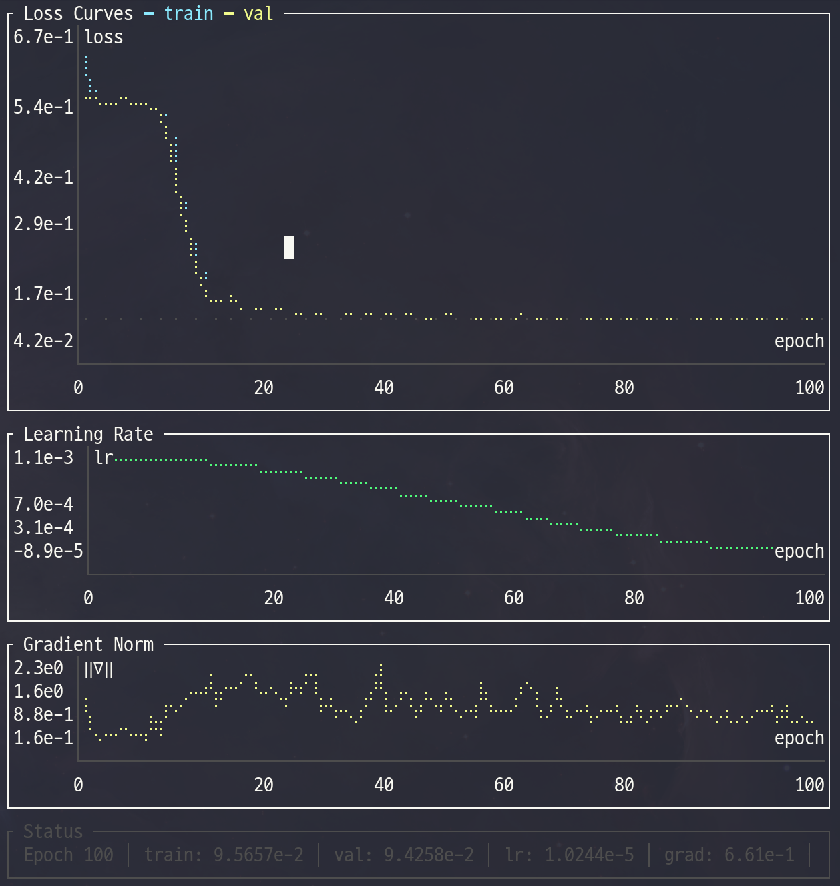

<div align="center">

# PyTorch Template

[English](README.md) | [한글](README_KR.md)

[](https://opensource.org/licenses/MIT)
[](https://www.python.org/downloads/)
[](https://pytorch.org/)
[](https://optuna.org/)
[](https://wandb.ai/)
[](#real-time-tui-monitor)

**One YAML. One command. Full research pipeline.**

*Config-driven experiment pipeline with dual logging, real-time TUI monitor, and AI agent skills.*


</div>

---

## Why This Template?

| Problem | Solution |
|---------|----------|
| Config errors discovered after hours of GPU time | `preflight` runs 1-batch forward+backward in seconds |
| Rewriting training loops for every project | Callback-based loop — extend without modifying the core |
| "Which logging do I use?" | Choose `wandb` or `tui` per config — CSV always saved |
| Can't see training progress without W&B | Rust TUI monitor renders loss curves in real-time from CSV |
| Manual hyperparameter tuning | Optuna + PFL pruner prunes unpromising trials early |
| HPO is a black box after it finishes | `hpo-report` shows parameter importance and boundary warnings |
| Silent overfitting or exploding gradients | Auto-detected by callbacks, logged to W&B/TUI/CSV |
| "It worked on my machine" | Full provenance: Python / PyTorch / CUDA / GPU / git hash |

---

## Quick Start

```bash
git clone https://github.com/Axect/pytorch_template.git && cd pytorch_template

# Install (uv recommended)
uv venv && source .venv/bin/activate
uv pip install -U torch wandb rich beaupy numpy optuna matplotlib \
  scienceplots typer tqdm pyyaml pytorch-optimizer pytorch-scheduler

# Check your environment
python -m cli doctor

# Validate → Preview → Train → Analyze
python -m cli preflight configs/run_template.yaml
python -m cli preview configs/run_template.yaml
python -m cli train configs/run_template.yaml --device cuda:0
python -m cli analyze
```

---

## How It Works

### Everything is YAML

```yaml
project: MyProject
device: cuda:0
logging: tui                                           # 'wandb' or 'tui'
net: model.MLP                                         # any importlib-resolvable path
optimizer: pytorch_optimizer.SPlus
scheduler: pytorch_scheduler.ExpHyperbolicLRScheduler
criterion: torch.nn.MSELoss
data: recipes.regression.data.load_data                # plug in any load_data() here
seeds: [89, 231, 928, 814, 269]                        # multi-seed reproducibility
epochs: 150
batch_size: 256
net_config:
  nodes: 64
  layers: 4
optimizer_config:
  lr: 1.e-1
scheduler_config:
  total_steps: 150
  upper_bound: 300
  min_lr: 1.e-6
```

All module paths are resolved via importlib. Three layers of validation run before a single GPU cycle is consumed:

1. **Structural** — format checks, non-empty seeds, positive epochs/batch_size
2. **Runtime** — CUDA availability, all import paths resolve
3. **Semantic** — `upper_bound >= total_steps`, lr positivity, unique seeds

### Dual Logging

The `logging` field controls where metrics are displayed:

| `logging:` | Display | W&B | CSV | latest_model.pt |
|---|---|---|---|---|
| `wandb` | W&B dashboard + periodic console print | Yes | Always | Always |
| `tui` | Every-epoch terminal output (agent-friendly) | No | Always | Always |

**CSV and latest model are always saved**, regardless of logging mode. This means:
- Agents can read `metrics.csv` and `latest_model.pt` mid-training
- The TUI monitor can render loss curves from any run
- No data is lost even without W&B

### Callback Architecture

The training loop emits events; behaviors are independent, priority-ordered callbacks:

| Callback | Priority | Purpose |
|----------|----------|---------|
| `NaNDetectionCallback` | 5 | Detect NaN loss, signal stop |
| `OptimizerModeCallback` | 10 | SPlus / ScheduleFree train/eval toggle |
| `GradientMonitorCallback` | 12 | Track gradient norms, warn on explosion |
| `LossPredictionCallback` | 70 | Predict final loss via shifted exponential fit |
| `OverfitDetectionCallback` | 75 | Detect train/val divergence |
| `WandbLoggingCallback` | 80 | Log to W&B (when `logging: wandb`) |
| `TUILoggingCallback` | 80 | Terminal logging (when `logging: tui`) |
| `CSVLoggingCallback` | 81 | Write `metrics.csv` every epoch (always active) |
| `PrunerCallback` | 85 | Report to Optuna pruner |
| `EarlyStoppingCallback` | 90 | Patience-based stopping |
| `CheckpointCallback` | 95 | Periodic + best-model checkpoints |
| `LatestModelCallback` | 96 | Save `latest_model.pt` every epoch (always active) |

Add your own by subclassing `TrainingCallback` — zero changes to the training loop:

```python
class GradientClipCallback(TrainingCallback):
    priority = 15  # runs right after GradientMonitorCallback

    def on_train_step_end(self, trainer, **kwargs):
        torch.nn.utils.clip_grad_norm_(trainer.model.parameters(), 1.0)
```

### Loss Prediction

The `LossPredictionCallback` fits a **shifted exponential decay** model to the validation loss history:

```
L(t) = a · exp(-b · t) + c
```

The predicted final loss is `c` (the asymptotic floor). The fitting uses EMA-smoothed data with a 3-point anchor method, which:
- Works with **positive and negative** losses
- Handles plateau, oscillation, and non-convergent patterns
- Returns raw loss values (same units as input)

---

## Real-time TUI Monitor

A **Rust-based** terminal UI reads `metrics.csv` and renders live charts:

<div align="center">



</div>

**Features:**
- Loss curves (train/val) with Braille sub-pixel rendering
- Learning rate schedule and gradient norm history
- Predicted final loss overlay
- Log scale toggle: `log₁₀` for positive data, `symlog₁₀` for mixed-sign
- Status bar with current metrics and time since last update
- 1.2 MB static binary — no runtime dependencies

**Usage:**

```bash
# Build once (requires Rust toolchain)
cd tools/monitor && cargo build --release && cd ../..

# Run alongside training (in a separate terminal)
python -m cli monitor                                      # auto-detect latest run
python -m cli monitor runs/MyProject/group/42/metrics.csv  # specific file

# Or run the binary directly
./tools/monitor/target/release/training-monitor runs/MyProject/group/42/
```

| Key | Action |
|-----|--------|
| `q` / `Esc` | Quit |
| `l` | Toggle log scale |
| `←` / `→` | Switch metric tabs (when custom metrics are logged) |

---

## Pre-flight Check

Catches problems in seconds — not after hours of GPU time:

```
                         Pre-flight Check
┌─────────────────────────┬────────┬──────────────────────────────────┐
│ Check                   │ Status │ Detail                           │
├─────────────────────────┼────────┼──────────────────────────────────┤
│ Import paths & device   │  PASS  │                                  │
│ Semantic validation     │  PASS  │                                  │
│ Object instantiation    │  PASS  │                                  │
│ Data loading            │  PASS  │ train=8000, val=2000             │
│ Forward pass            │  PASS  │ output=(256, 1), loss=0.512341   │
│ Shape check             │  PASS  │                                  │
│ Gradient check          │  PASS  │ grad norm=0.034821               │
│ Optimizer step          │  PASS  │                                  │
│ Scheduler step          │  PASS  │                                  │
│ GPU memory              │  PASS  │ peak=42.3 MB (1 batch)           │
└─────────────────────────┴────────┴──────────────────────────────────┘
All pre-flight checks passed.
```

Use `--json` for machine-readable output (used by AI agent skills for automated parsing).

---

## HPO with Optuna

```bash
# Run HPO
python -m cli train configs/my_run.yaml --optimize-config configs/my_opt.yaml

# Analyze results
python -m cli hpo-report --opt-config configs/my_opt.yaml
```

The custom **PFL (Predicted Final Loss) pruner** fits shifted exponential decay to early loss history and prunes trials before they waste GPU time.

```
Study: my_study (MyProject_Opt.db)
Trials: 50 total, 38 completed, 11 pruned, 1 failed

Best Trial #23
  Value: 0.003241

         Parameter Importance
┌─────────────────────────┬──────────────────────────────────────┐
│ Parameter               │ Importance                           │
├─────────────────────────┼──────────────────────────────────────┤
│ optimizer_config_lr     │ 0.8741 ██████████████████████████    │
│ net_config_layers       │ 0.1259 ████                          │
└─────────────────────────┴──────────────────────────────────────┘

Boundary Warnings:
  optimizer_config_lr=0.231 at UPPER boundary [1e-3, 1e+0]
```

A boundary warning means the optimizer would benefit from a wider search range.

---

## AI-Assisted Training (Claude Code Skill)

This template ships with a built-in [Claude Code](https://claude.ai/claude-code) skill that guides you through the entire experiment lifecycle:

```
You: "Set up HPO for my FluxNet model, version 0.3"

Agent: Creates configs/SolarFlux_v0.3/fluxnet_run.yaml
       Creates configs/SolarFlux_v0.3/fluxnet_opt.yaml
       Runs preflight to catch any config issues
       Launches HPO with SPlus + ExpHyperbolicLR defaults
       Runs hpo-report to analyze results
       Extracts best params → fluxnet_best.yaml
       Launches final multi-seed training
```

The skill encodes domain knowledge: correct lr ranges for SPlus (1e-3 to 1e+0), why `total_steps` must not be synced to HPO `epochs` for hyperbolic schedulers, and how to interpret boundary warnings.

> See [`.claude/skills/pytorch-train/`](.claude/skills/pytorch-train/) for details.

### Migrating Existing Projects

If you have a project based on an older version of this template, the **pytorch-migrate** skill can detect your current version and apply incremental updates automatically.

**Install skills globally** (once):

```bash
python -m cli update-skills          # symlink (auto-updates with git pull)
python -m cli update-skills --copy   # or copy if you prefer
```

**Use in any project:**

```bash
cd ~/my-project  # any pytorch_template-based project
# In Claude Code:
/pytorch-migrate
```

The skill detects which features are missing (v1 through v6) and applies only the needed migrations, preserving your custom models, data loaders, and callbacks.

---

## Extend It

<details>
<summary><strong>Custom Model</strong></summary>

```python
# my_model.py
class MyTransformer(nn.Module):
    def __init__(self, hparams: dict, device: str = "cpu"):
        super().__init__()
        self.d_model = hparams["d_model"]
```

```yaml
net: my_model.MyTransformer
net_config:
  d_model: 256
  nhead: 8
```

</details>

<details>
<summary><strong>Custom Loss Function</strong></summary>

```yaml
criterion: my_losses.FocalLoss
criterion_config:
  gamma: 2.0
  alpha: 0.25
```

</details>

<details>
<summary><strong>Custom Data</strong></summary>

Create a module with a `load_data()` function that returns `(train_dataset, val_dataset)`:

```python
# recipes/myproject/data.py
def load_data():
    return train_dataset, val_dataset
```

```yaml
data: recipes.myproject.data.load_data
```

See [`recipes/regression/`](recipes/regression/) and [`recipes/classification/`](recipes/classification/) for complete examples.

</details>

<details>
<summary><strong>Custom Metrics</strong></summary>

```python
from metrics import MetricRegistry
registry = MetricRegistry(["mse", "mae", "r2", "my_module.MyMetric"])
results = registry.compute(y_pred, y_true)
```

</details>

---

## Project Structure

```
pytorch_template/
├── cli.py              # CLI: train, preflight, validate, preview, doctor, analyze, hpo-report, monitor
├── config.py           # RunConfig (frozen, 3-tier validation) + OptimizeConfig
├── util.py             # Trainer, run(), predict_final_loss()
├── callbacks.py        # 12 built-in callbacks + CallbackRunner
├── checkpoint.py       # CheckpointManager + SeedManifest
├── provenance.py       # Environment capture + config hashing
├── pruner.py           # PFL pruner for Optuna
├── metrics.py          # Metric registry (MSE, MAE, R2)
├── model.py            # Built-in MLP
├── configs/            # YAML config templates
├── recipes/            # Example recipes (regression, classification)
├── tools/monitor/      # Rust TUI monitor (ratatui)
├── tests/              # Unit tests
├── docs/               # Human Skill Guide
└── .claude/skills/     # AI Skills (pytorch-train, pytorch-migrate)
```

### Output per Seed Run

```
runs/{project}/{group}/{seed}/
├── model.pt            # Final model state_dict
├── latest_model.pt     # Updated every epoch
├── metrics.csv         # Real-time CSV log (all metrics)
├── env_snapshot.yaml   # Environment metadata
├── run_metadata.yaml   # Training metadata
├── best.pt             # Best checkpoint (if enabled)
└── latest.pt           # Full checkpoint (if enabled)
```

---

## CLI Reference

| Command | Description |
|---------|-------------|
| `train <config> [--device DEV] [--optimize-config OPT]` | Train or run HPO |
| `preflight <config> [--device DEV] [--json]` | 1-batch forward+backward check |
| `validate <config>` | Structural + runtime config validation |
| `preview <config>` | Show model architecture and param count |
| `doctor` | Check Python, PyTorch, CUDA, wandb, packages |
| `hpo-report [--db DB] [--opt-config OPT] [--top-k K] [--json]` | HPO analysis: param importance, boundary warnings |
| `analyze [--project P] [--group G] [--seed S]` | Evaluate a trained model |
| `monitor [PATH] [--interval MS] [--list]` | Launch real-time TUI monitor (or list available runs) |
| `update-skills [--copy] [--uninstall]` | Install/update Claude Code skills to ~/.claude/skills/ |

All commands are invoked via `python -m cli <command>`.

---

## Documentation

| | AI Agent Skill | Human Guide |
|---|---|---|
| **Location** | `.claude/skills/pytorch-train/` | [`docs/`](https://axect.github.io/pytorch_template) |
| **Teaches** | Config rules, param ranges, CLI commands | Design decisions, trade-offs, workflow intuition |

**[Read the Human Skill Guide](https://axect.github.io/pytorch_template)** — 5 chapters covering the full pipeline.

## License

[MIT](LICENSE)

## Acknowledgments

- [pytorch-optimizer](https://github.com/kozistr/pytorch_optimizer) — optimizers including SPlus
- [pytorch-scheduler](https://github.com/Axect/pytorch_scheduler) — schedulers including ExpHyperbolicLR
- [Optuna](https://optuna.org/) — hyperparameter optimization framework
- [ratatui](https://ratatui.rs/) — Rust TUI framework for the training monitor
