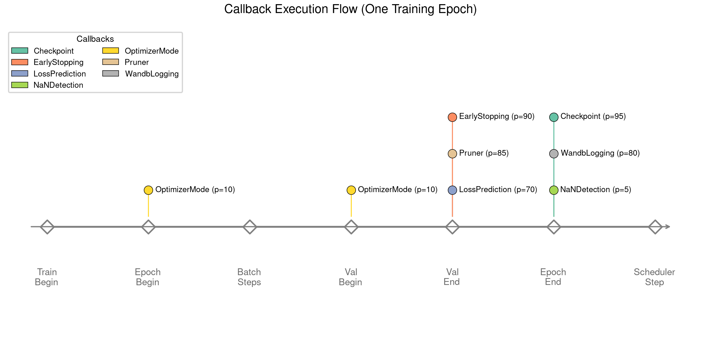

<div align="center">

# PyTorch Template

[English](README.md) | [한글](README_KR.md)

[](https://opensource.org/licenses/MIT)
[](https://www.python.org/downloads/)
[](https://pytorch.org/)
[](https://optuna.org/)
[](https://wandb.ai/)

**One YAML. One command. Full research pipeline.**

*Not just another PyTorch boilerplate — a complete experiment pipeline with CLI tools and AI agent skills.*

</div>

```bash
# 1. Validate before you waste GPU time
python -m cli preflight configs/my_run.yaml --device cuda:0

# 2. Train (or run HPO)
python -m cli train configs/my_run.yaml --optimize-config configs/my_opt.yaml

# 3. Understand what HPO found
python -m cli hpo-report --opt-config configs/my_opt.yaml

# 4. Analyze the best model
python -m cli analyze --project MyProject --group <group> --seed <seed>
```

---

## Why This Template?

| Problem | Solution |
|---------|----------|
| Config errors discovered after hours of GPU time | `preflight` runs 1 batch forward+backward in seconds — catches shape mismatches, bad imports, NaN gradients, and GPU OOM before training starts |
| Scattered experiment configs across scripts | Single frozen YAML per experiment, fully validated before execution |
| Rewriting training loops for every project | Callback-based loop — extend without modifying the loop itself |
| "It worked on my machine" | Full provenance captured: Python / PyTorch / CUDA / GPU / git hash per run |
| Manual hyperparameter tuning | Optuna + PFL pruner prunes unpromising trials early |
| HPO is a black box after it finishes | `hpo-report` shows parameter importance (fANOVA), boundary warnings, and top-K trial comparison |
| Silent overfitting or exploding gradients | `GradientMonitorCallback` and `OverfitDetectionCallback` auto-detect both, logged to W&B |
| Can't reproduce last month's result | Deterministic multi-seed training + checkpoint resume |

---

<div align="center">

## The Full Pipeline

```
configs/my_run.yaml          ← define everything in one YAML
        │
        ▼
python -m cli preflight      ← catch errors in seconds, not after hours
        │
        ▼
python -m cli train \        ← HPO with Optuna + PFL pruner
  --optimize-config ...
        │
        ▼
python -m cli hpo-report     ← param importance, boundary warnings, top-K
        │
        ▼
python -m cli train \        ← final multi-seed training with best params
  configs/my_best.yaml
        │
        ▼
python -m cli analyze        ← validate results, generate plots
```

</div>

**Phase 1 — Config creation.** One YAML defines model, optimizer, scheduler, criterion, seeds, and the `data` field that points to any `load_data()` function via importlib. No code changes to swap datasets.

**Phase 2 — Pre-flight check.** Before committing to a full run, `preflight` exercises the entire forward+backward pass on one batch and reports pass/warn/fail for every component.

**Phase 3 — Training with diagnostics.** The callback system automatically monitors gradient norms and train/val divergence throughout training, logging everything to W&B.

**Phase 4 — HPO with Optuna + PFL pruner.** The custom PFL (Predicted Final Loss) pruner fits exponential decay curves to early loss history and prunes trials before they waste GPU time.

**Phase 5 — HPO analysis.** `hpo-report` reads the Optuna SQLite database and produces fANOVA-based parameter importance, boundary warnings (best param at search space edge means you should widen it), and a ranked top-K trial table.

**Phase 6 — Final training.** Promote the best HPO params into a `best.yaml`, expand to multi-seed, and train to completion.

**Phase 7 — Analysis.** `analyze` loads any checkpoint interactively and evaluates on the validation set.

---

## AI-Assisted Training (Claude Code Skill)

This template ships with a built-in [Claude Code](https://claude.ai/claude-code) skill that guides you through the entire experiment lifecycle:

```
You: "Set up HPO for my FluxNet model, version 0.3"

Agent: Creates configs/SolarFlux_v0.3/fluxnet_run.yaml
       Creates configs/SolarFlux_v0.3/fluxnet_opt.yaml
       Runs preflight to catch any config issues
       Launches HPO with SPlus + ExpHyperbolicLR defaults
       Runs hpo-report to analyze results
       Extracts best params → fluxnet_best.yaml
       Launches final multi-seed training
```

The skill encodes domain knowledge: correct lr ranges for SPlus (1e-3 to 1e+0, not the standard 1e-5 to 1e-2), why `total_steps` must not be synced to HPO `epochs` for hyperbolic schedulers, and how to interpret boundary warnings. You get research-grade defaults without memorizing them.

> See [`.claude/skills/pytorch-train/`](.claude/skills/pytorch-train/) for details. Existing users can run `/pytorch-migrate` to update their projects to the latest version.

## Documentation — Two Skills, One Pipeline

This template has two kinds of skills that teach the same pipeline:

| | AI Agent Skill | Human Skill |
|---|---|---|
| **Location** | `.claude/skills/pytorch-train/` | [`docs/`](https://axect.github.io/pytorch_template) |
| **Reads** | Config rules, param ranges, CLI commands | Workflow intuition, design decisions, trade-offs |
| **Learns** | *What* to do | *Why* to do it |

**[Read the Human Skill Guide](https://axect.github.io/pytorch_template)** — 5 chapters covering the full pipeline, configuration deep dive, callback system, HPO strategies, and customization.

---

## Quick Start

```bash
git clone https://github.com/Axect/pytorch_template.git && cd pytorch_template

# Install (uv recommended)
uv venv && source .venv/bin/activate
uv pip install -U torch wandb rich beaupy numpy optuna matplotlib \
  scienceplots typer tqdm pyyaml pytorch-optimizer pytorch-scheduler

# Check your environment
python -m cli doctor

# Validate a config before training
python -m cli preflight configs/run_template.yaml

# Preview the model architecture (no training)
python -m cli preview configs/run_template.yaml

# Train
python -m cli train configs/run_template.yaml --device cuda:0

# Analyze results
python -m cli analyze
```

---

## How It Works

### Everything is YAML

```yaml
project: MyProject
device: cuda:0
net: model.MLP                                         # any importlib-resolvable path
optimizer: pytorch_optimizer.SPlus
scheduler: pytorch_scheduler.ExpHyperbolicLRScheduler
criterion: torch.nn.MSELoss
criterion_config: {}
data: recipes.regression.data.load_data                # plug in any load_data() here
seeds: [89, 231, 928, 814, 269]                        # multi-seed reproducibility
epochs: 150
batch_size: 256
net_config:
  nodes: 64
  layers: 4
optimizer_config:
  lr: 1.e-1
  eps: 1.e-10
scheduler_config:
  total_steps: 150
  upper_bound: 300
  min_lr: 1.e-6
```

The `data` field points to any `load_data()` function via importlib. Change dataset by changing one line — no edits to `cli.py` or `util.py` required.

All module paths (model, optimizer, scheduler, criterion, data) are resolved at runtime. Three layers of validation run before a single GPU cycle is consumed:

1. **Structural** — format checks, non-empty seeds, positive epochs/batch_size, module.Class format
2. **Runtime** — CUDA availability, all import paths actually resolve
3. **Semantic** — `upper_bound >= total_steps` for hyperbolic schedulers, lr positivity, unique seeds, early stopping patience vs epochs

### Callback Architecture

The training loop emits events; behaviors are independent, priority-ordered callbacks:



| Callback | Priority | Purpose |
|----------|----------|---------|
| `NaNDetectionCallback` | 5 | Detect NaN loss, signal stop |
| `OptimizerModeCallback` | 10 | SPlus / ScheduleFree train/eval toggle |
| `GradientMonitorCallback` | 12 | Detect exploding gradients, log grad norm to W&B |
| `LossPredictionCallback` | 70 | Predict final loss for PFL pruner |
| `OverfitDetectionCallback` | 75 | Detect train/val divergence, log gap ratio to W&B |
| `WandbLoggingCallback` | 80 | Log all metrics to Weights & Biases |
| `PrunerCallback` | 85 | Report to Optuna pruner, raise TrialPruned |
| `EarlyStoppingCallback` | 90 | Patience-based stopping |
| `CheckpointCallback` | 95 | Periodic + best-model checkpoints |

Add your own by subclassing `TrainingCallback` — zero changes to the training loop:

```python
class GradientClipCallback(TrainingCallback):
    priority = 15  # runs right after GradientMonitorCallback

    def on_train_step_end(self, trainer, **kwargs):
        torch.nn.utils.clip_grad_norm_(trainer.model.parameters(), 1.0)
```

### Pre-flight Check

Run before any training run or HPO job. Catches problems in seconds rather than after hours:

```
                         Pre-flight Check
┌─────────────────────────┬────────┬──────────────────────────────────────────┐
│ Check                   │ Status │ Detail                                   │
├─────────────────────────┼────────┼──────────────────────────────────────────┤
│ Import paths & device   │  PASS  │                                          │
│ Semantic validation     │  PASS  │                                          │
│ Object instantiation    │  PASS  │                                          │
│ Data loading            │  PASS  │ train=8000, val=2000                     │
│ Forward pass            │  PASS  │ output=(256, 1), loss=0.512341           │
│ Shape check             │  PASS  │                                          │
│ Gradient check          │  PASS  │ grad norm=0.034821                       │
│ Optimizer step          │  PASS  │                                          │
│ Scheduler step          │  PASS  │                                          │
│ GPU memory              │  PASS  │ peak=42.3 MB (1 batch)                   │
└─────────────────────────┴────────┴──────────────────────────────────────────┘
All pre-flight checks passed.
```

Use `--json` for machine-readable output (used by the Claude Code skill for automated parsing):

```bash
python -m cli preflight configs/my_run.yaml --device cuda:0 --json
```

### HPO Analysis

After HPO, run `hpo-report` to understand what Optuna found — not just what the best params are, but whether the search space was wide enough:

```
Study: my_study (MyProject_Opt.db)
Trials: 50 total, 38 completed, 11 pruned, 1 failed

Best Trial #23
  Value: 0.003241
  Group: MLP_n_64_l_4_SP_lr_2.3e-01_EHLS_t_150_u_300_m_1e-06
  optimizer_config_lr: 0.231
  net_config_layers: 4

         Parameter Importance
┌─────────────────────────┬──────────────────────────────────────┐
│ Parameter               │ Importance                           │
├─────────────────────────┼──────────────────────────────────────┤
│ optimizer_config_lr     │ 0.8741 ██████████████████████████    │
│ net_config_layers       │ 0.1259 ████                          │
└─────────────────────────┴──────────────────────────────────────┘

Boundary Warnings:
  optimizer_config_lr=0.231 at UPPER boundary [1e-3, 1e+0]
```

A boundary warning means the optimizer would benefit from a wider search range. The skill picks these up automatically and prompts you to widen the range before re-running.

---

## Extend It

<details>
<summary><strong>Custom Model</strong></summary>

```python
# my_model.py
class MyTransformer(nn.Module):
    def __init__(self, hparams: dict, device: str = "cpu"):
        super().__init__()
        # hparams comes directly from net_config in YAML
        self.d_model = hparams["d_model"]
```

```yaml
net: my_model.MyTransformer
net_config:
  d_model: 256
  nhead: 8
```

</details>

<details>
<summary><strong>Custom Loss Function</strong></summary>

```yaml
criterion: my_losses.FocalLoss
criterion_config:
  gamma: 2.0
  alpha: 0.25
```

</details>

<details>
<summary><strong>Custom Metrics</strong></summary>

```python
from metrics import MetricRegistry
registry = MetricRegistry(["mse", "mae", "r2", "my_module.MyMetric"])
results = registry.compute(y_pred, y_true)
```

</details>

<details>
<summary><strong>Custom Data</strong></summary>

Create a module with a `load_data()` function that returns `(train_dataset, val_dataset)`, then point to it in the config:

```python
# recipes/myproject/data.py
def load_data():
    # build your datasets
    return train_dataset, val_dataset
```

```yaml
data: recipes.myproject.data.load_data
```

No changes to `cli.py` or `util.py`. See [`recipes/regression/`](recipes/regression/) and [`recipes/classification/`](recipes/classification/) for complete examples.

</details>

---

## Project Structure

```
pytorch_template/
├── cli.py              # CLI: train, preflight, validate, preview, doctor, analyze, hpo-report
├── config.py           # RunConfig (frozen, 3-tier validation) + OptimizeConfig
├── util.py             # Trainer, run(), data loading
├── callbacks.py        # 9 built-in callbacks + CallbackRunner
├── checkpoint.py       # CheckpointManager + SeedManifest
├── provenance.py       # Environment capture + config hashing
├── pruner.py           # PFL pruner for Optuna
├── metrics.py          # Metric registry (MSE, MAE, R2)
├── model.py            # Built-in MLP
├── configs/            # YAML config templates
├── recipes/            # Example recipes (regression, classification)
├── tests/              # Unit tests
├── docs/               # Human Skill Guide (the docs you read)
└── .claude/skills/     # AI Skills (pytorch-train, pytorch-migrate)
```

---

## CLI Reference

| Command | Description |
|---------|-------------|
| `python -m cli train <config> [--device DEV] [--optimize-config OPT]` | Train or run HPO |
| `python -m cli preflight <config> [--device DEV] [--json]` | Pre-flight check: 1-batch forward+backward, shape/gradient/memory |
| `python -m cli validate <config>` | Structural + runtime config validation only |
| `python -m cli preview <config>` | Show model architecture and param count, no training |
| `python -m cli doctor` | Check Python, PyTorch, CUDA, wandb, required packages |
| `python -m cli hpo-report [--db DB] [--opt-config OPT] [--top-k K] [--json]` | Analyze HPO results: param importance, boundary warnings, top-K |
| `python -m cli analyze [--project P] [--group G] [--seed S] [--device DEV]` | Evaluate a trained model checkpoint |

## License

[MIT](LICENSE)

## Acknowledgments

- [pytorch-optimizer](https://github.com/kozistr/pytorch_optimizer) — optimizers including SPlus
- [pytorch-scheduler](https://github.com/Axect/pytorch_scheduler) — schedulers including ExpHyperbolicLR
- [Optuna](https://optuna.org/) — hyperparameter optimization framework
