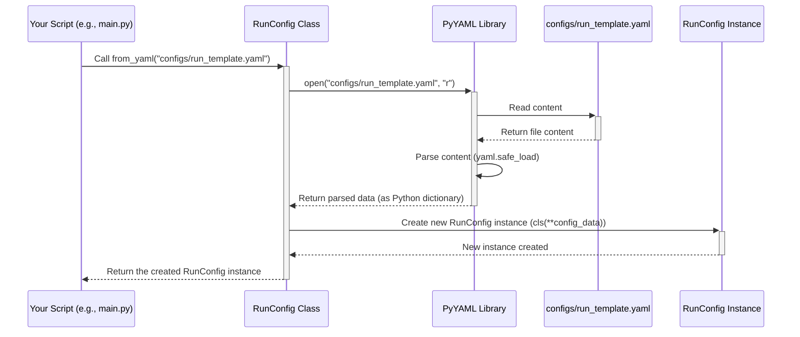

# Chapter 1: Configuration Management (`RunConfig` / `OptimizeConfig`)

Welcome to the `pytorch_template` project! This tutorial will guide you through its core components, helping you understand how to run and manage your machine learning experiments effectively.

Let's start with a fundamental question: When you run a machine learning experiment, how do you keep track of all the settings you used? What kind of model did you train? What learning rate did you use? How many training cycles (epochs) did you run? If you want to run the *exact* same experiment again later, or just change one small setting, how do you do that easily?

This is where **Configuration Management** comes in.

## The Problem: Keeping Track of Experiment Details

Imagine you're baking a cake. You need a recipe! The recipe tells you:
*   What ingredients to use (flour, sugar, eggs)
*   How much of each ingredient (2 cups flour, 1 cup sugar, 3 eggs)
*   The instructions (mix dry ingredients, add wet ingredients, bake at 180°C for 30 minutes)

If you just mix things randomly, you might get a cake, but you probably won't be able to make the *same* delicious cake again. And if you want to try making it a bit sweeter next time, you need to know how much sugar you used *this* time.

Machine learning experiments are similar. You have many "ingredients" and "instructions":
*   **Model:** What kind of neural network? How many layers? How many nodes per layer?
*   **Training:** What learning rate? How many epochs? What batch size?
*   **Optimizer:** Which algorithm to use for updating the model (e.g., AdamW, SGD)?
*   **Device:** Run on CPU or GPU?
*   **Seeds:** Random numbers for initialization (important for reproducibility).

Manually keeping track of all this is messy and error-prone. You might forget a setting, or make a typo when setting it up again.

## The Solution: Recipe Cards for Experiments (YAML + `RunConfig`)

`pytorch_template` solves this using configuration files, specifically **YAML** files (`.yaml`). Think of a YAML file as the **master recipe card** for your experiment. It clearly lists all the "ingredients" and "settings."

We then use a special Python tool called `RunConfig` to read this recipe card and set up the experiment exactly as described.

### What is a YAML File?

YAML (YAML Ain't Markup Language) is a human-friendly way to write down structured data. It uses indentation (spaces) to show structure.

Here's a simplified example of what a configuration file might look like (`configs/run_template.yaml`):

```yaml
# configs/run_template.yaml (Simplified)
project: MyCoolProject
device: cuda:0       # Use the first GPU

# --- Model Settings ---
net: model.MLP       # Which model code to use (MLP = Multi-Layer Perceptron)
net_config:
  nodes: 64          # Number of nodes in hidden layers
  layers: 4          # Number of hidden layers

# --- Training Settings ---
optimizer: torch.optim.adamw.AdamW # Optimizer algorithm
optimizer_config:
  lr: 0.001          # Learning rate

epochs: 50           # Number of training cycles
batch_size: 256      # How many data samples per step

seeds: [42]          # Random seed for reproducibility
```

This file clearly defines the key settings for a single experiment run. It's easy to read and easy to change. Want to try a different learning rate? Just change `lr: 0.001` to `lr: 0.0005`. Want to use a different model? Change the `net` value.

### What is `RunConfig`?

`RunConfig` is a Python class (defined in `config.py`) designed to read these YAML files. It acts like the "chef" who reads the recipe card (YAML) and knows how to use that information.

```python
# config.py (Conceptual Snippet)
from dataclasses import dataclass
import yaml

@dataclass # Makes creating classes for storing data easier
class RunConfig:
    project: str
    device: str
    seeds: list[int]
    net: str
    optimizer: str
    epochs: int
    batch_size: int
    net_config: dict
    optimizer_config: dict
    # ... other fields like scheduler, early stopping ...

    @classmethod
    def from_yaml(cls, path: str):
        # Reads the YAML file from the given path
        with open(path, "r") as file:
            config_data = yaml.safe_load(file)
        # Creates a RunConfig object using the data
        return cls(**config_data)

    # ... methods to create model, optimizer etc. ...
```

*   The `@dataclass` decorator helps automatically set up the class to store the data fields (like `project`, `device`, etc.).
*   The `from_yaml` method is crucial: it takes the path to a YAML file, reads it using the `yaml` library, and creates a `RunConfig` object holding all those settings.

### How to Use `RunConfig`

In your main script (which we'll explore more in [Chapter 2: Experiment Execution Orchestration (`main.py`)](02_experiment_execution_orchestration___main_py___.md)), you'll typically load the configuration like this:

```python
# main.py (Conceptual Snippet)
from config import RunConfig

# 1. Specify the path to your recipe card
config_path = "configs/run_template.yaml"

# 2. Load the configuration using RunConfig
run_config = RunConfig.from_yaml(config_path)

# 3. Now you can access all settings easily
print(f"Project Name: {run_config.project}")
print(f"Device: {run_config.device}")
print(f"Model Layers: {run_config.net_config['layers']}")
print(f"Learning Rate: {run_config.optimizer_config['lr']}")

# Output:
# Project Name: MyCoolProject
# Device: cuda:0
# Model Layers: 4
# Learning Rate: 0.001

# Later, use run_config to set up the experiment:
# model = run_config.create_model() # See Chapter 4
# optimizer = run_config.create_optimizer(model) # See Chapter 3
# ... and so on ...
```

By loading the YAML into `RunConfig`, your Python code gets easy access to all the settings needed to set up and run the experiment consistently.

### Internal Implementation: Loading the Config

Let's trace what happens when you call `RunConfig.from_yaml("configs/run_template.yaml")`:



1.  **Your script** calls the `RunConfig.from_yaml` method with the file path.
2.  **`RunConfig`** uses standard Python file opening to read the `configs/run_template.yaml` file.
3.  It passes the file content to the **PyYAML library's** `safe_load` function.
4.  **PyYAML** parses the text, understanding the structure (like `net_config` containing `nodes` and `layers`), and converts it into a Python dictionary.
5.  **`RunConfig`** receives this dictionary. The `cls(**config_data)` part cleverly unpacks the dictionary, matching keys (like `"project"`, `"device"`) to the `RunConfig` class fields, and creates a new `RunConfig` **object** (instance) filled with these values.
6.  This fully-populated **`RunConfig` object** is returned to your script.

The code for this is quite concise:

```python
# config.py (Inside RunConfig class)

    @classmethod
    def from_yaml(cls, path: str):
        # Open the specified YAML file for reading ('r')
        with open(path, "r") as file:
            # Use the yaml library to safely load the structure
            # This turns the YAML text into a Python dictionary
            config_data = yaml.safe_load(file)

        # 'cls' refers to the RunConfig class itself.
        # '**config_data' unpacks the dictionary so that
        # key-value pairs become arguments to the constructor.
        # e.g., if config_data = {'project': 'MyCoolProject', ...}
        # this becomes RunConfig(project='MyCoolProject', ...)
        return cls(**config_data)
```

## What About Finding the *Best* Settings (`OptimizeConfig`)?

So far, `RunConfig` helps us manage the settings for *one specific* experiment run. But what if you don't know the best learning rate or the optimal number of layers? You might want to try many different combinations automatically to find the best-performing setup.

This is called **Hyperparameter Optimization**. For this, `pytorch_template` uses a second type of configuration: `OptimizeConfig`.

Think of `OptimizeConfig` as the recipe for *running many experiments* to find the best `RunConfig`. It defines:
*   Which settings (`RunConfig` parameters like `lr`, `layers`) you want to search over.
*   What range of values to try for each setting.
*   How many different combinations (trials) to run.
*   Which metric to use to judge which run is "best" (e.g., lowest validation loss).

Here's a peek at a simplified `configs/optimize_template.yaml`:

```yaml
# configs/optimize_template.yaml (Simplified)
study_name: FindBestMLP
trials: 20          # Try 20 different combinations
metric: val_loss    # Aim to minimize validation loss
direction: minimize

# Define the search space: which settings to vary
search_space:
  net_config:
    layers:
      type: int     # Layer count is an integer
      min: 3        # Try between 3 and 5 layers
      max: 5
  optimizer_config:
    lr:
      type: float   # Learning rate is a float
      min: 0.0001   # Try between 0.0001 and 0.01
      max: 0.01
      log: true     # Search learning rate on a logarithmic scale
```

`OptimizeConfig` works closely with a library called Optuna to automate this search process. We'll dive deep into this in [Chapter 5: Hyperparameter Optimization (Optuna Integration)](05_hyperparameter_optimization__optuna_integration__.md). For now, just know that `RunConfig` defines *one* run, and `OptimizeConfig` defines how to *search for the best* `RunConfig`.

## Conclusion

You've learned about the importance of configuration management for reproducible and organized machine learning experiments.

*   **YAML files** act as human-readable "recipe cards" for your experiments.
*   **`RunConfig`** is a Python class that reads these YAML files and holds all the settings for a single experiment run. It makes accessing settings in your code clean and easy.
*   Using `RunConfig.from_yaml(path)` is the standard way to load your experiment setup.
*   **`OptimizeConfig`** (which we'll cover later) helps define how to search for the *best* set of configurations automatically.

By defining your experiments in configuration files, you make them easier to understand, modify, share, and reproduce – crucial aspects of any serious machine learning project.

Now that we know how to *define* all the settings for an experiment using `RunConfig`, let's move on to see how the project actually uses this configuration to start and manage the experiment execution process.

**Next Up:** [Chapter 2: Experiment Execution Orchestration (`main.py`)](02_experiment_execution_orchestration___main_py___.md)

---

Generated by [AI Codebase Knowledge Builder](https://github.com/The-Pocket/Tutorial-Codebase-Knowledge)