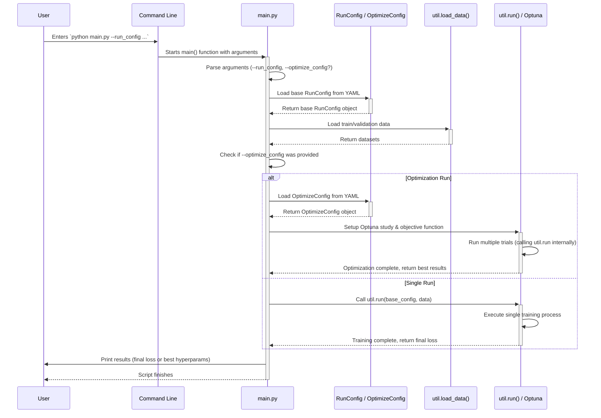

# Chapter 2: Experiment Execution Orchestration (`main.py`)

Welcome back! In [Chapter 1: Configuration Management (`RunConfig` / `OptimizeConfig`)](01_configuration_management___runconfig_____optimizeconfig___.md), we learned how to create a detailed "recipe card" (our YAML configuration file) and how the `RunConfig` class helps us read that recipe into our Python code. We have the plan, but how do we actually *start* the cooking process?

Think about building a house. You have the blueprints (`RunConfig`). Now you need a **project manager** to read the blueprints, gather the workers and materials (data, model), tell them what to do, and oversee the construction (training).

In `pytorch_template`, the file `main.py` acts as this project manager. It's the main entry point – the script you run from your terminal to kick off the entire experiment.

## The Problem: Starting and Managing the Experiment

You have your configuration file (`run_template.yaml`) ready. How do you tell the computer: "Okay, use *this* configuration file, load the data, build the model described in the file, and start training it"?

Furthermore, what if you have *two* configuration files: one for a basic run (`run_template.yaml`) and another (`optimize_template.yaml`) that describes how to search for the *best* settings? How does the program know whether to run a single experiment or start a big search?

This is the job of `main.py`: **Experiment Execution Orchestration**. It orchestrates (coordinates) all the necessary steps to get an experiment running based on the instructions you provide.

## Key Tasks of `main.py`

`main.py` is relatively simple because it delegates most complex tasks, but its coordination role is vital. Here's what it does:

1.  **Reads Instructions:** It takes the path to your main configuration file (`.yaml`) as an input when you run the script.
2.  **Understands Your Goal:** It checks if you *also* provided an optimization configuration file. This tells it whether you want a single run or a hyperparameter search.
3.  **Prepares Resources:** It loads the necessary dataset (like gathering ingredients).
4.  **Initiates Work:**
    *   If it's a **single run**, it uses the `RunConfig` to set up everything and calls the `run` function (which manages the training process, involving the [Chapter 3: Training Loop (`Trainer`)](03_training_loop___trainer___.md)).
    *   If it's an **optimization search**, it sets up an "objective" function using the `OptimizeConfig` and tells the Optuna library (covered in [Chapter 5: Hyperparameter Optimization (Optuna Integration)](05_hyperparameter_optimization__optuna_integration__.md)) to start searching.

## How to Use `main.py`

You interact with `main.py` through your command line terminal.

### Use Case 1: Running a Single Experiment

Let's say you want to run the experiment defined in `configs/run_template.yaml`.

1.  **Open your terminal.**
2.  **Navigate to the project directory.**
3.  **Run the following command:**

```bash
python main.py --run_config configs/run_template.yaml
```

*   `python main.py`: Tells Python to execute the `main.py` script.
*   `--run_config configs/run_template.yaml`: This is an argument telling `main.py` which configuration file to use for the experiment settings.

**What happens?**
`main.py` will:
*   Read `configs/run_template.yaml` using `RunConfig`.
*   Load the training and validation data.
*   Call the `run` function (from `util.py`) with the loaded configuration and data.
*   The `run` function will then set up the model, optimizer, etc., and start the training loop (using the `Trainer`). You'll see output messages showing the training progress (epoch number, loss values).
*   Results (like the trained model) will be saved in a `runs/` directory.

### Use Case 2: Running Hyperparameter Optimization

Now, imagine you want to find the best learning rate and number of layers, using the search strategy defined in `configs/optimize_template.yaml` based on the defaults in `configs/run_template.yaml`.

1.  **Open your terminal.**
2.  **Navigate to the project directory.**
3.  **Run the following command:**

```bash
python main.py --run_config configs/run_template.yaml --optimize_config configs/optimize_template.yaml
```

*   `--run_config ...`: Provides the base settings.
*   `--optimize_config ...`: Tells `main.py` to perform an optimization study using this *additional* configuration file.

**What happens?**
`main.py` will:
*   Read *both* configuration files (`RunConfig` for base settings, `OptimizeConfig` for the search).
*   Load the data.
*   Set up an Optuna study.
*   Instead of calling `run` directly once, it will repeatedly call a special `objective` function. Each call represents one *trial* (one experiment with a different combination of hyperparameters suggested by Optuna).
*   Inside the `objective` function, it modifies the base `RunConfig` with the suggested parameters for that trial and then calls the `run` function.
*   Optuna manages this process for the specified number of trials.
*   Finally, it prints the best parameters found.

## Internal Implementation: How `main.py` Works

Let's peek under the hood to see how `main.py` orchestrates these tasks.

### High-Level Flow

When you execute `python main.py --run_config ... [--optimize_config ...]`:



This diagram shows `main.py` acting as the central coordinator, reading configuration, loading data, and then deciding whether to launch a single run via `util.run` or an optimization study via Optuna (which itself uses `util.run` for each trial).

### Code Walkthrough (`main.py`)

Let's look at the key parts of the `main` function in `main.py`:

1.  **Argument Parsing:** It uses Python's `argparse` library to understand the command-line arguments you provide.

    ```python
    # main.py (Simplified Snippet 1)
    import argparse
    from config import RunConfig, OptimizeConfig
    # ... other imports: DataLoader, wandb, load_data, run ...

    def main():
        parser = argparse.ArgumentParser()
        # Expect '--run_config' and make it required
        parser.add_argument(
            "--run_config", type=str, required=True, help="Path to the YAML config file"
        )
        # Expect '--optimize_config' but make it optional
        parser.add_argument(
            "--optimize_config", type=str, help="Path for optimization config (optional)"
        )
        # Read the arguments provided by the user
        args = parser.parse_args()
        # ... rest of the main function ...
    ```
    This sets up the script to accept `--run_config` (mandatory) and `--optimize_config` (optional).

2.  **Loading Base Configuration and Data:** It loads the essential `RunConfig` and the datasets.

    ```python
    # main.py (Simplified Snippet 2 - inside main())

    # Load the main experiment settings from the specified YAML file
    base_config = RunConfig.from_yaml(args.run_config)

    # Load the training and validation datasets
    # (Implementation details in util.py)
    ds_train, ds_val = load_data() # pyright: ignore

    # Create DataLoaders for efficient batching during training
    dl_train = DataLoader(ds_train, batch_size=base_config.batch_size, shuffle=True)
    dl_val = DataLoader(ds_val, batch_size=base_config.batch_size, shuffle=False)
    ```
    This uses the `RunConfig.from_yaml` method we discussed in Chapter 1 and a utility function `load_data` to prepare the necessary inputs for training.

3.  **Deciding the Execution Path:** This is the core orchestration logic. It checks if the optional `--optimize_config` argument was provided.

    ```python
    # main.py (Simplified Snippet 3 - inside main())

    # Check if the user provided an optimization config file path
    if args.optimize_config:
        # --- OPTIMIZATION PATH ---
        print("Optimization mode selected.")
        # Load the optimization settings
        optimize_config = OptimizeConfig.from_yaml(args.optimize_config)

        # Define the 'objective' function that Optuna will call for each trial
        # (Details covered in Chapter 5)
        def objective(trial, ...):
            # ... Suggest parameters using trial ...
            # ... Create a modified RunConfig ...
            # ... Call the run() function for this trial ...
            # ... return final_loss ...
            pass # Simplified for now

        # Create and run the Optuna study
        # (Details covered in Chapter 5)
        study = optimize_config.create_study(...)
        study.optimize(objective, n_trials=optimize_config.trials)

        # Print the best results found by Optuna
        print("Best trial:", study.best_trial)
        # ... print details ...

    else:
        # --- SINGLE RUN PATH ---
        print("Single run mode selected.")
        # Directly call the run function with the base configuration and data
        # The run function handles the actual training loop (using Trainer)
        final_loss = run(base_config, dl_train, dl_val)
        print(f"Single run finished. Final validation loss: {final_loss}")

    ```
    *   **`if args.optimize_config:`**: If the user provided the optimization config path, it loads `OptimizeConfig`, sets up the Optuna study, defines the `objective` function (which wraps a single `run`), and starts the optimization process. We'll explore this branch in detail in [Chapter 5: Hyperparameter Optimization (Optuna Integration)](05_hyperparameter_optimization__optuna_integration__.md).
    *   **`else:`**: If no optimization config was given, it assumes a standard single run. It calls the `run` function (defined in `util.py`) directly, passing the loaded `base_config` and the data loaders. The `run` function encapsulates setting up the model, optimizer, and running the training epochs using the `Trainer` class, which is the focus of our next chapter.

4.  **Starting the Script:** The standard Python entry point check ensures the `main()` function runs when you execute the script.

    ```python
    # main.py (Simplified Snippet 4 - bottom of the file)

    # This standard Python construct checks if the script is being run directly
    # (not imported as a module)
    if __name__ == "__main__":
        # If run directly, call the main function to start the process
        main()
    ```

## Conclusion

You've now seen how `main.py` acts as the central **orchestrator** or **project manager** for your experiments in `pytorch_template`. It's the starting point that reads your configuration(s), prepares the data, and then intelligently decides whether to launch a single training run or a complex hyperparameter optimization study.

Key takeaways:

*   `main.py` is the script you execute from the command line.
*   It uses command-line arguments (`--run_config`, `--optimize_config`) to understand what you want to do.
*   It loads the necessary configuration objects ([Chapter 1: Configuration Management (`RunConfig` / `OptimizeConfig`)](01_configuration_management___runconfig_____optimizeconfig___.md)) and data.
*   It delegates the actual work:
    *   For a single run, it calls the `run` function (which uses the `Trainer`).
    *   For optimization, it sets up and runs an Optuna study ([Chapter 5: Hyperparameter Optimization (Optuna Integration)](05_hyperparameter_optimization__optuna_integration__.md)).

We saw that for a single run, `main.py` calls the `run` function, which in turn relies on something called a `Trainer`. What exactly happens inside that training process? Let's dive into the heart of the learning process next.

**Next Up:** [Chapter 3: Training Loop (`Trainer`)](03_training_loop___trainer___.md)

---

Generated by [AI Codebase Knowledge Builder](https://github.com/The-Pocket/Tutorial-Codebase-Knowledge)