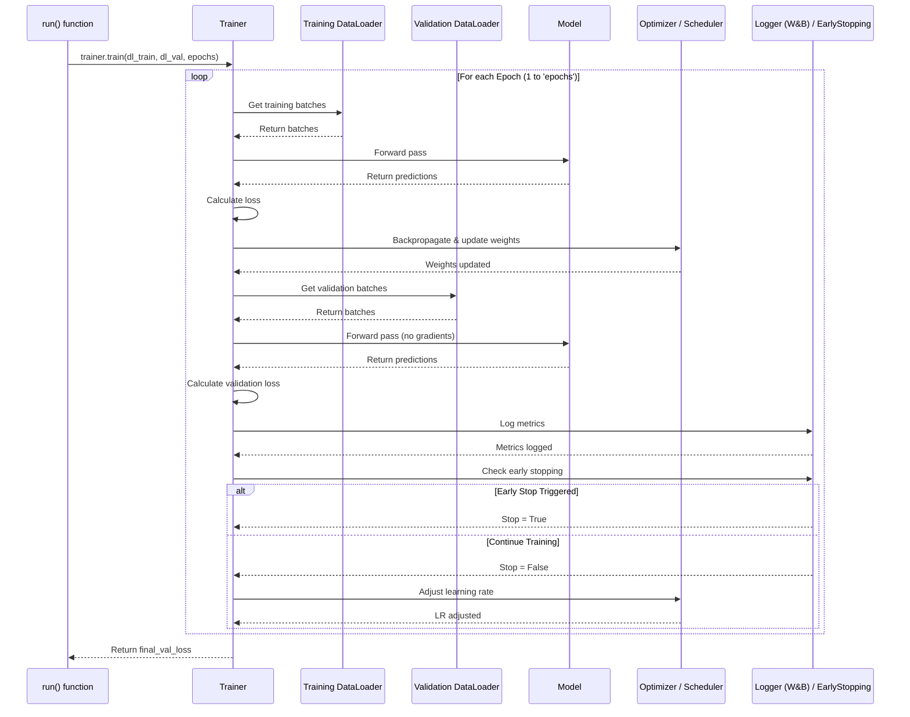

# Chapter 3: Training Loop (`Trainer`)

Welcome back! In [Chapter 1: Configuration Management (`RunConfig` / `OptimizeConfig`)](01_configuration_management___runconfig_____optimizeconfig___.md), we learned how to create the "recipe" (configuration) for our experiment. In [Chapter 2: Experiment Execution Orchestration (`main.py`)](02_experiment_execution_orchestration___main_py___.md), we saw how `main.py` acts as the project manager, reading the recipe and kicking things off.

But who actually *does* the heavy lifting of teaching the machine learning model? How does the model learn from the data, cycle after cycle?

This is where the **`Trainer`** class comes in.

## The Problem: Managing the Model's Workout Routine

Imagine you have a new student (your machine learning model) who wants to learn a skill (like recognizing patterns in data). You also have the textbooks (your data) and a goal (minimize errors). How do you structure the learning process?

You wouldn't just show the student the entire textbook at once! You'd probably:
1.  Give them a chapter (a **batch** of data) to study.
2.  Let them try applying what they learned (a **forward pass**).
3.  Check their understanding and point out mistakes (calculate the **loss**).
4.  Explain how to correct those mistakes (perform **backpropagation**).
5.  Help them update their knowledge (use the **optimizer** to adjust model weights).
6.  Repeat this for all chapters in the textbook (complete one **epoch**).
7.  Occasionally give them a practice test on material they haven't explicitly studied for (a **validation step**) to see if they're truly learning or just memorizing.
8.  Keep track of their progress (log **metrics**).
9.  Adjust the difficulty or learning speed if needed (use a **scheduler**).
10. Decide if they've learned enough or if they're stuck and need to stop early (**early stopping**).
11. Repeat this whole process (multiple **epochs**) until the learning goal is reached.

Doing all this manually for every experiment is tedious and repetitive.

## The Solution: A Personal Trainer for Your Model (`Trainer`)

The `Trainer` class (defined in `util.py`) is like a **personal trainer** for your model. It encapsulates all the steps of the training workout routine described above. You give the `Trainer` the necessary equipment:
*   The `model` to train.
*   The `optimizer` (how to update the model's weights).
*   The `criterion` (how to measure errors, e.g., Mean Squared Error loss).
*   The `scheduler` (how to adjust the learning rate over time, optional).
*   The training and validation `DataLoader`s (providing batches of data).
*   Configuration for `early_stopping` (when to stop if progress stalls).
*   The `device` (CPU or GPU) to train on.

Once set up, the `Trainer` handles the entire workout session (the training loop over many epochs).

## How the `Trainer` is Used (Inside the `run` function)

You typically don't create or call the `Trainer` directly from `main.py`. Instead, the `run` function (which we saw being called by `main.py` in Chapter 2) sets up and uses the `Trainer`.

Let's look at how `run` (in `util.py`) prepares and starts the training process:

```python
# util.py (Simplified Snippet from 'run' function)

def run(run_config: RunConfig, dl_train, dl_val, ...):
    # ... (setup like loading model, optimizer, scheduler from run_config) ...
    # Get the model, optimizer, scheduler, etc. defined in the config
    model = run_config.create_model().to(run_config.device)
    optimizer = run_config.create_optimizer(model)
    scheduler = run_config.create_scheduler(optimizer)
    # Define the loss function (e.g., Mean Squared Error)
    criterion = torch.nn.functional.mse_loss

    # 1. CREATE THE TRAINER:
    #    Give it all the necessary components.
    trainer = Trainer(
        model=model,
        optimizer=optimizer,
        scheduler=scheduler,
        criterion=criterion,
        early_stopping_config=run_config.early_stopping_config, # From YAML
        device=run_config.device,
        # (Other args like trial, seed, pruner for advanced features)
    )

    # 2. START THE TRAINING:
    #    Tell the trainer to run the workout for a set number of epochs.
    final_val_loss = trainer.train(
        dl_train=dl_train,  # Training data loader
        dl_val=dl_val,      # Validation data loader
        epochs=run_config.epochs # Number of cycles from YAML
    )

    # ... (save model, finish logging) ...
    print(f"Training finished. Final validation loss: {final_val_loss}")
    return final_val_loss
```

1.  **Create the Trainer:** The `run` function gathers all the necessary components (model, optimizer, etc., often created based on the `RunConfig`) and passes them to the `Trainer` when creating it.
2.  **Start the Training:** It then calls the `trainer.train()` method, providing the data loaders and the total number of epochs (training cycles) to run.

The `trainer.train()` call blocks execution until the training is complete (either by finishing all epochs or by early stopping). It returns the final validation loss achieved.

## Internal Implementation: Inside the Trainer's Workout

What happens when `trainer.train()` is called? Let's break down the `Trainer`'s logic.

### High-Level Flow

The `train` method orchestrates the overall process, looping through epochs and calling helper methods for training and validation within each epoch.



This diagram shows the cycle: for each epoch, the `Trainer` calls `train_epoch` (which iterates through training batches, performs forward/backward passes, and updates weights) and `val_epoch` (which iterates through validation batches and calculates loss without updating weights). After each epoch, it logs metrics, checks for early stopping, and adjusts the learning rate.

### Code Walkthrough (`util.py` - `Trainer` class)

Let's look at the key methods inside the `Trainer` class:

1.  **Initialization (`__init__`)**: Stores the components.

    ```python
    # util.py (Simplified Trainer.__init__)
    class Trainer:
        def __init__(
            self,
            model,
            optimizer,
            scheduler,
            criterion,
            early_stopping_config=None, # Configuration for early stopping
            device="cpu",
            # trial=None, seed=None, pruner=None # For advanced features
        ):
            # Store all the parts needed for training
            self.model = model
            self.optimizer = optimizer
            self.scheduler = scheduler
            self.criterion = criterion # Loss function
            self.device = device

            # Setup early stopping if configured
            self.early_stopping = None
            if early_stopping_config and early_stopping_config.enabled:
                self.early_stopping = EarlyStopping( # From util.py
                    patience=early_stopping_config.patience,
                    mode=early_stopping_config.mode,
                    min_delta=early_stopping_config.min_delta,
                )
    ```
    This method simply takes all the essential objects (model, optimizer, etc.) and saves them as attributes of the `Trainer` instance (`self.model`, `self.optimizer`, etc.) so other methods can use them. It also creates an `EarlyStopping` helper object if specified in the configuration.

2.  **Training an Epoch (`train_epoch`)**: Performs one full pass over the training data.

    ```python
    # util.py (Simplified Trainer.train_epoch)
    def train_epoch(self, dl_train):
        self.model.train() # Set model to training mode (enables dropout etc.)
        train_loss = 0
        # Loop through batches from the training DataLoader
        for x, y in dl_train:
            x = x.to(self.device) # Move data to the correct device (CPU/GPU)
            y = y.to(self.device)

            # 1. Forward pass: Get model's prediction
            y_pred = self.model(x)
            # 2. Calculate loss: How wrong was the prediction?
            loss = self.criterion(y_pred, y)
            train_loss += loss.item() # Accumulate loss

            # 3. Backward pass: Calculate gradients
            self.optimizer.zero_grad() # Reset gradients from previous batch
            loss.backward()
            # 4. Optimizer step: Update model weights based on gradients
            self.optimizer.step()

        # Calculate average loss for the epoch
        train_loss /= len(dl_train)
        return train_loss
    ```
    This is the core learning step. For each batch of data, it calculates the model's prediction, computes the error (loss), calculates how to adjust the weights to reduce the error (backpropagation), and applies those adjustments (optimizer step).

3.  **Validating an Epoch (`val_epoch`)**: Performs one full pass over the validation data to check performance.

    ```python
    # util.py (Simplified Trainer.val_epoch)
    def val_epoch(self, dl_val):
        self.model.eval() # Set model to evaluation mode (disables dropout etc.)
        val_loss = 0
        # No need to track gradients during validation
        with torch.no_grad():
            # Loop through batches from the validation DataLoader
            for x, y in dl_val:
                x = x.to(self.device)
                y = y.to(self.device)

                # 1. Forward pass: Get model's prediction
                y_pred = self.model(x)
                # 2. Calculate loss: How wrong was the prediction?
                loss = self.criterion(y_pred, y)
                val_loss += loss.item() # Accumulate loss

        # Calculate average loss for the epoch
        val_loss /= len(dl_val)
        return val_loss
    ```
    This is similar to `train_epoch` but crucially *doesn't* perform backpropagation or update the optimizer. It's just measuring performance on unseen data. `torch.no_grad()` tells PyTorch not to calculate gradients, saving memory and computation.

4.  **The Main Training Loop (`train`)**: Orchestrates the epochs.

    ```python
    # util.py (Simplified Trainer.train)
    import wandb # For logging (Weights & Biases)
    import math

    def train(self, dl_train, dl_val, epochs):
        final_val_loss = math.inf # Initialize with a high value

        # Loop for the specified number of epochs
        for epoch in range(epochs):
            # --- Perform one training epoch ---
            train_loss = self.train_epoch(dl_train)
            # --- Perform one validation epoch ---
            val_loss = self.val_epoch(dl_val)
            final_val_loss = val_loss # Keep track of the latest val loss

            # --- Logging ---
            log_dict = {
                "train_loss": train_loss,
                "val_loss": val_loss,
                "lr": self.optimizer.param_groups[0]["lr"], # Log learning rate
            }
            wandb.log(log_dict) # Log metrics to Weights & Biases

            # --- Print Progress ---
            if epoch % 10 == 0 or epoch == epochs - 1:
                print(f"Epoch {epoch}: Train Loss={train_loss:.4f}, Val Loss={val_loss:.4f}")

            # --- Early Stopping Check ---
            if self.early_stopping is not None:
                if self.early_stopping(val_loss): # Check if criteria met
                    print(f"Early stopping triggered at epoch {epoch}")
                    break # Exit the loop

            # --- Scheduler Step ---
            # Adjust learning rate (if a scheduler is used)
            self.scheduler.step()

            # --- Handle potential NaN issues ---
            if math.isnan(train_loss) or math.isnan(val_loss):
                print("Stopping early due to NaN loss.")
                final_val_loss = math.inf # Indicate failure
                break

            # --- (Advanced: Pruning check would go here for Optuna) ---

        return final_val_loss # Return the last computed validation loss
    ```
    This method ties everything together. It iterates through the desired number of epochs. In each epoch, it calls `train_epoch`, then `val_epoch`, logs the results (using `wandb.log`), prints progress occasionally, checks if early stopping conditions are met, and updates the learning rate scheduler. It also includes basic checks for invalid loss values (NaN).

## Conclusion

The `Trainer` class is the workhorse that manages the detailed, step-by-step process of training your model. It encapsulates the standard PyTorch training loop logic, making the `run` function cleaner and focusing it on setup and teardown.

Key takeaways:

*   The `Trainer` acts like a **personal trainer**, guiding the model's learning workout.
*   It handles iterating through data (**epochs** and **batches**).
*   It manages the core steps: **forward pass**, **loss calculation**, **backpropagation**, and **optimizer step**.
*   It performs **validation** to check generalization.
*   It integrates **logging** (e.g., W&B) and **early stopping**.
*   It's typically created and used within the `run` function ([Chapter 2: Experiment Execution Orchestration (`main.py`)](02_experiment_execution_orchestration___main_py___.md)), using components defined by the `RunConfig` ([Chapter 1: Configuration Management (`RunConfig` / `OptimizeConfig`)](01_configuration_management___runconfig_____optimizeconfig___.md)).

Now that we understand how the model is *trained* by the `Trainer`, let's look at how the model itself is *defined*. What neural network architectures can we use, and how are they specified?

**Next Up:** [Chapter 4: Model Definition (`model.py`)](04_model_definition___model_py___.md)

---

Generated by [AI Codebase Knowledge Builder](https://github.com/The-Pocket/Tutorial-Codebase-Knowledge)
