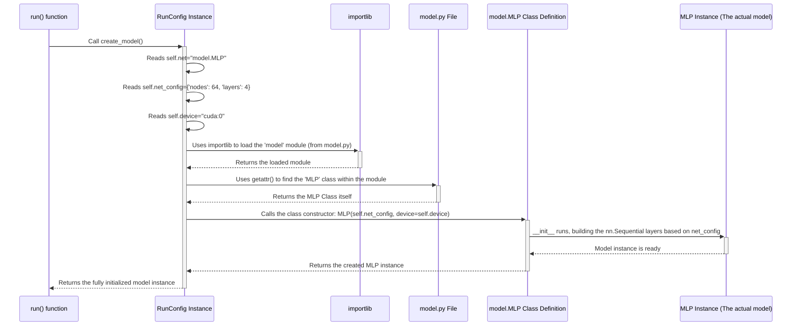

# Chapter 4: Model Definition (`model.py`)

Welcome back! In [Chapter 3: Training Loop (`Trainer`)](03_training_loop___trainer___.md), we saw how the `Trainer` class takes a model and meticulously trains it using our data. But where does this `model` actually come from? How do we define the structure of the neural network itself – the "brain" we are teaching?

This chapter focuses on the **blueprint** of our machine learning model, defined in the `model.py` file.

## The Problem: Defining the Machine's Architecture

Think about building with LEGOs. You have a box full of different bricks (layers like linear, activation), but you need a plan or blueprint to build something specific, like a car or a house. Just having the bricks isn't enough; you need instructions on how to connect them.

Similarly, in neural networks, we need to define:
*   What types of layers to use (e.g., linear layers for processing connections, activation functions like GELU to introduce non-linearity).
*   How many layers to stack.
*   How many "neurons" or "nodes" each layer should have.
*   How the data should flow through these layers.

Hardcoding a specific model structure directly into the training script (`run` function or `Trainer`) would be inflexible. What if we want to try a different number of layers, or a completely different type of network (like a Convolutional Neural Network, CNN) later? We need a way to easily define and swap different model architectures.

## The Solution: Model Blueprints in `model.py` and Configuration Choice

`pytorch_template` handles this by:

1.  **Defining Model Blueprints (`model.py`):** This file contains Python classes that represent different neural network architectures. Each class inherits from PyTorch's `nn.Module` and describes the layers and their connections. The template provides a basic `MLP` (Multi-Layer Perceptron) class as a starting point.
2.  **Choosing the Blueprint and Details (YAML Config):** The configuration file ([Chapter 1: Configuration Management (`RunConfig` / `OptimizeConfig`)](01_configuration_management___runconfig_____optimizeconfig___.md)) specifies *which* model class from `model.py` to use and provides the specific parameters for that blueprint (like the number of layers or nodes).

### Analogy: The Blueprint Library

Imagine `model.py` is a library of different building blueprints:
*   `Blueprint MLP`: A simple multi-story office building.
*   `Blueprint CNN` (if you added one): A factory designed for image processing.
*   `Blueprint Transformer` (if you added one): A complex communication hub for language tasks.

Your configuration file (`run_template.yaml`) acts like an order form:
*   "I want to build using **Blueprint MLP**." (`net: model.MLP`)
*   "Make it **4 stories** high." (`net_config -> layers: 4`)
*   "Each story should have **64 rooms**." (`net_config -> nodes: 64`)

The `RunConfig` class then reads this order form and knows how to find the `MLP` blueprint in the library (`model.py`) and tell the construction crew (PyTorch) to build it exactly to those specifications.

## How Models are Defined and Used

Let's see how this works in practice.

1.  **Configuration (`configs/run_template.yaml`):**
    You specify the model and its parameters here.

    ```yaml
    # configs/run_template.yaml (Relevant parts)
    # ... other settings ...

    # Which model blueprint to use?
    # Format: 'filename_without_py.ClassName'
    net: model.MLP

    # Specific details for the chosen blueprint (MLP)
    net_config:
      nodes: 64      # How many neurons in the hidden layers
      layers: 4      # How many hidden layers

    # ... other settings ...
    ```
    This tells the system to use the `MLP` class found in the `model.py` file, configured with 64 nodes per hidden layer and 4 hidden layers.

2.  **Model Definition (`model.py`):**
    This file contains the actual Python code for the `MLP` class.

    ```python
    # model.py (Simplified MLP Class)
    from torch import nn

    # All PyTorch models should inherit from nn.Module
    class MLP(nn.Module):
        # The __init__ method sets up the layers
        def __init__(self, hparams, device="cpu"):
            super(MLP, self).__init__() # Important initialization
            self.hparams = hparams # Store config like nodes, layers
            self.device = device

            # Get parameters from the config dictionary (hparams)
            nodes = hparams["nodes"]
            layers = hparams["layers"]
            input_size = 1 # Assuming 1 input feature for simplicity
            output_size = 1 # Assuming 1 output value

            # Build a list of layers
            net_layers = [
                nn.Linear(input_size, nodes), # Input layer
                nn.GELU()                     # Activation function
            ]
            # Add the hidden layers
            for _ in range(layers - 1):
                net_layers.append(nn.Linear(nodes, nodes)) # Hidden layer
                net_layers.append(nn.GELU())                # Activation
            # Add the final output layer
            net_layers.append(nn.Linear(nodes, output_size))

            # nn.Sequential bundles layers together in order
            self.net = nn.Sequential(*net_layers)

        # The forward method defines how data flows through the layers
        def forward(self, x):
            # Just pass the input 'x' through the sequential network
            return self.net(x)
    ```
    *   **`class MLP(nn.Module):`**: Defines our custom model class, inheriting PyTorch's essential `nn.Module`.
    *   **`__init__(self, hparams, ...)`**: The constructor. It receives the `net_config` dictionary (here called `hparams`) and uses the `nodes` and `layers` values to create the desired sequence of `nn.Linear` (fully connected) layers and `nn.GELU` (activation function) layers. `nn.Sequential` conveniently packages these layers so data flows through them in order.
    *   **`forward(self, x)`**: This crucial method defines the *forward pass*. When you call the model instance like `output = model(input_data)`, this `forward` method is automatically executed. Here, it simply passes the input `x` through the `self.net` sequence of layers.

3.  **Instantiation (`config.py` and `run` function):**
    The `RunConfig` class has a helper method `create_model` that reads the `net` string from the config and dynamically creates an instance of the specified model class. This happens inside the `run` function (from `util.py`) before training starts.

    ```python
    # util.py (Inside the 'run' function - Conceptual)

    def run(run_config: RunConfig, dl_train, dl_val, ...):
        # ... other setup ...

        # Use RunConfig to create the model instance based on YAML settings
        print(f"Creating model: {run_config.net} with config: {run_config.net_config}")
        model = run_config.create_model().to(run_config.device)

        print("Model created successfully:", model) # Shows the structure

        # ... create optimizer, trainer, etc. using this 'model' ...
        # trainer = Trainer(model=model, ...)
        # trainer.train(...)
        # ...
    ```
    The `run_config.create_model()` call is the magic step that connects the configuration file to the actual model code in `model.py`.

## Internal Implementation: How `create_model` Works

How does `run_config.create_model()` know how to find and build the `model.MLP` specified in the YAML? It uses a Python feature called dynamic importing.

### High-Level Flow



1.  The `run()` function calls `run_config.create_model()`.
2.  `create_model` looks at the `net` string (`"model.MLP"`) stored within the `RunConfig` object.
3.  It splits the string into the module name (`"model"`) and the class name (`"MLP"`).
4.  It uses Python's `importlib` library to dynamically load the `model.py` file as a module.
5.  It then gets the `MLP` class definition from that loaded module.
6.  Finally, it calls the `MLP` class constructor, passing the `net_config` dictionary and the `device` string as arguments. This triggers the `MLP.__init__` method we saw earlier, which builds the actual layers.
7.  The newly created `MLP` model object is returned.

### Code Walkthrough (`config.py` - `create_model`)

Here's the relevant code snippet from the `RunConfig` class:

```python
# config.py (Inside RunConfig class)
import importlib # Library for dynamic imports

# ... other methods ...

def create_model(self):
    # Split "model.MLP" into module="model" and class="MLP"
    module_name, class_name = self.net.rsplit(".", 1)

    # Dynamically load the module (equivalent to 'import model')
    module = importlib.import_module(module_name)

    # Get the class definition from the loaded module
    # (equivalent to 'ModelClass = model.MLP')
    model_class = getattr(module, class_name)

    # Create an instance of the class, passing config and device
    # (equivalent to 'MLP(self.net_config, device=self.device)')
    return model_class(self.net_config, device=self.device)
```

This clever use of `importlib` makes the system flexible. If you define a new model class `MyCNN` in `model.py`, you just need to change the YAML `net:` entry to `model.MyCNN`, and this code will automatically find and instantiate your new model without needing any changes here!

## Adding Your Own Models

The template is designed to be easily extended. If you want to try a different architecture:

1.  **Define the Class:** Create a new Python class in `model.py` that inherits from `torch.nn.Module`. Implement its `__init__` (to build layers based on expected `net_config` parameters) and `forward` (to define data flow) methods.
2.  **Update Configuration:** In your YAML configuration file, change the `net:` field to point to your new class (e.g., `net: model.MyNewModel`).
3.  **Adjust `net_config`:** Make sure the `net_config:` section in your YAML provides the parameters your new model's `__init__` method expects.

That's it! The rest of the framework (`RunConfig`, `Trainer`) will automatically use your new model.

## Conclusion

You've learned how `pytorch_template` separates the definition of the neural network's architecture (`model.py`) from its configuration and usage.

Key takeaways:

*   **`model.py`** contains Python classes (like `MLP`) that act as **blueprints** for neural network architectures, inheriting from `torch.nn.Module`.
*   Each model class defines its layers in `__init__` and the data flow in `forward`.
*   The **YAML configuration file** specifies *which* model blueprint to use (`net:` field) and its specific construction parameters (`net_config:`).
*   The **`RunConfig.create_model()`** method dynamically reads the configuration and instantiates the correct model class with the specified parameters.
*   This makes it easy to experiment with different model architectures by simply changing the configuration file and adding new model classes to `model.py`.

We now understand how the experiment is configured ([Chapter 1]), how it's started ([Chapter 2]), how the model is trained ([Chapter 3]), and how the model itself is defined ([Chapter 4]). But what if we don't know the *best* configuration values (like the ideal number of `layers` or the optimal `learning rate`) beforehand? How can we automatically search for them?

**Next Up:** [Chapter 5: Hyperparameter Optimization (Optuna Integration)](05_hyperparameter_optimization__optuna_integration__.md)

---

Generated by [AI Codebase Knowledge Builder](https://github.com/The-Pocket/Tutorial-Codebase-Knowledge)