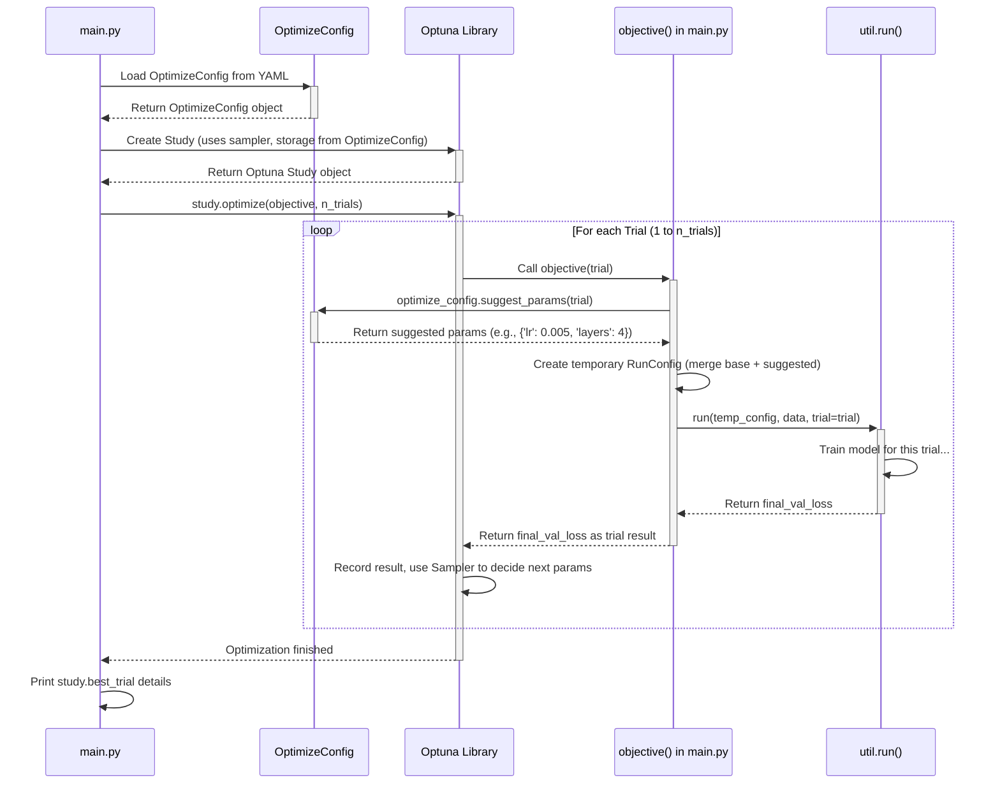

# Chapter 5: Hyperparameter Optimization (Optuna Integration)

Welcome back! In [Chapter 4: Model Definition (`model.py`)](04_model_definition___model_py___.md), we saw how to create the blueprint for our neural network (the `model`). We know how to configure a single experiment ([Chapter 1]), start it ([Chapter 2]), and train the model ([Chapter 3]).

But a big question remains: how do we know *which* settings in our configuration file are the *best* ones? What's the ideal learning rate? How many layers should our model have? Should we use 64 nodes or 128? Trying out all these combinations manually would take forever!

## The Problem: Finding the Best Recipe Ingredients

Imagine you have a basic cake recipe (`RunConfig`). You know you need flour, sugar, and eggs, but you're not sure about the exact *amounts*. Will 1 cup of sugar be best, or 1.5 cups? Will 3 eggs make it too rich, or is 2 eggs not enough?

Similarly, in machine learning, we have "ingredients" called **hyperparameters**. These are settings we choose *before* training starts, like:
*   `learning_rate`: How fast the model learns.
*   `layers`: Number of layers in the network.
*   `nodes`: Number of neurons per layer.
*   `batch_size`: How many data samples to look at in one go.

Finding the right combination of these hyperparameters is crucial for getting good performance. A tiny change in learning rate can be the difference between a model that learns well and one that fails completely. Manually tweaking these values, running an experiment, checking the results, and repeating is slow and inefficient.

## The Solution: An Automated Recipe Tester (Optuna + `OptimizeConfig`)

This project uses a fantastic library called **Optuna** to automate the search for the best hyperparameters. Think of Optuna as an **automated recipe tester**. You tell it:
1.  **Which ingredients (hyperparameters) to test:** e.g., "try sugar between 1 and 2 cups", "try eggs between 2 and 4".
2.  **How many variations (trials) to bake:** e.g., "bake 20 different cakes".
3.  **How to judge the taste (metric):** e.g., "find the cake with the lowest 'blandness score' (validation loss)".

Optuna then intelligently tries different combinations of hyperparameters, runs a full training experiment for each combination (a "trial"), and keeps track of which combination performed best according to your chosen metric.

In `pytorch_template`, we define the instructions for Optuna using a special configuration file, managed by the `OptimizeConfig` class ([Chapter 1: Configuration Management (`RunConfig` / `OptimizeConfig`)](01_configuration_management___runconfig_____optimizeconfig___.md)).

### Key Concepts Explained

*   **Hyperparameters:** Settings you define *before* training (e.g., `lr`, `layers`, `nodes`). These are *not* learned during training like the model's internal weights.
*   **Optimization Study:** The whole process of searching for the best hyperparameters, managed by Optuna.
*   **Trial:** A single experiment run within the study. Each trial uses a *different set* of hyperparameter values suggested by Optuna.
*   **Objective Function:** A Python function *you* define that Optuna calls for each trial. This function takes the suggested hyperparameters, runs the training process ([Chapter 3: Training Loop (`Trainer`)](03_training_loop___trainer___.md)), and returns a score (the metric value, like validation loss) for that trial.
*   **Search Space:** Defined in `OptimizeConfig` (and the YAML file), this tells Optuna the *range* or *choices* for each hyperparameter it should explore (e.g., `layers` between 3 and 5, `lr` between 0.0001 and 0.01).
*   **Sampler:** The strategy Optuna uses to pick the *next* set of hyperparameters to try. Some samplers just pick randomly, while others (like the default `TPESampler`) learn from past trials to make smarter guesses.
*   **Metric & Direction:** The score you want to optimize (e.g., `val_loss`) and whether you want to make it as small as possible (`minimize`) or as large as possible (`maximize`).

## How to Use Hyperparameter Optimization

Let's run an optimization study to find the best number of nodes, layers, and learning rate for our simple MLP model.

1.  **Prepare the Optimization Config (`configs/optimize_template.yaml`):**
    This file tells Optuna how to conduct the search.

    ```yaml
    # configs/optimize_template.yaml
    study_name: Optimize_MLP_Example # Name for this search process
    trials: 20          # Run 20 different experiments (trials)
    seed: 42            # Random seed for reproducibility of the search itself
    metric: val_loss    # The score to optimize (from training logs)
    direction: minimize # We want the lowest validation loss

    # How Optuna should pick parameters (Tree-structured Parzen Estimator is common)
    sampler:
      name: optuna.samplers.TPESampler
      # kwargs: # Optional arguments for the sampler
      #   n_startup_trials: 5 # How many trials to run randomly before optimizing

    # (We'll cover the 'pruner' in the next chapter)
    pruner:
      name: pruner.PFLPruner
      # ... pruner settings ...

    # Define the hyperparameters to search (the "ingredients" to vary)
    search_space:
      # Category corresponding to RunConfig field 'net_config'
      net_config:
        nodes:
          type: categorical # Choose from a list of options
          choices: [32, 64, 128]
        layers:
          type: int         # Integer value
          min: 3            # Minimum number of layers
          max: 5            # Maximum number of layers
      # Category corresponding to RunConfig field 'optimizer_config'
      optimizer_config:
        lr:
          type: float       # Floating-point number
          min: 1.e-4        # Minimum learning rate (0.0001)
          max: 1.e-2        # Maximum learning rate (0.01)
          log: true         # Search this space logarithmically (good for rates)
      # (You can add more hyperparameters here if needed)
    ```
    This config tells Optuna:
    *   Run 20 trials for a study named `Optimize_MLP_Example`.
    *   Aim to `minimize` the `val_loss`.
    *   Use the `TPESampler`.
    *   For each trial, try:
        *   `nodes` being either 32, 64, or 128.
        *   `layers` being an integer between 3 and 5 (inclusive).
        *   `lr` being a float between 0.0001 and 0.01 (on a log scale).

2.  **Run `main.py` with Both Configs:**
    Go to your terminal and run the command we saw in [Chapter 2: Experiment Execution Orchestration (`main.py`)](02_experiment_execution_orchestration___main_py___.md), providing *both* the base run config and the optimization config:

    ```bash
    python main.py --run_config configs/run_template.yaml --optimize_config configs/optimize_template.yaml
    ```

3.  **Observe the Output:**
    You'll see output indicating that Optuna is running. It will print messages for each trial it starts and finishes, showing the parameters it tried and the resulting `val_loss`. This might take a while, as it's running 20 full training sessions!

    ```
    [I 2023-10-27 10:00:00,000] A new study created in RDB storage: sqlite:///MyCoolProject_Opt.db
    Optimization mode selected.
    Trial 0 finished with value: 0.0123 and parameters: {'net_config_nodes': 64, 'net_config_layers': 4, 'optimizer_config_lr': 0.005}. Best is trial 0 with value: 0.0123.
    Trial 1 finished with value: 0.0250 and parameters: {'net_config_nodes': 32, 'net_config_layers': 3, 'optimizer_config_lr': 0.009}. Best is trial 0 with value: 0.0123.
    Trial 2 finished with value: 0.0080 and parameters: {'net_config_nodes': 128, 'net_config_layers': 5, 'optimizer_config_lr': 0.001}. Best is trial 2 with value: 0.0080.
    ... (many more trials) ...
    Trial 19 finished with value: 0.0095 and parameters: {'net_config_nodes': 64, 'net_config_layers': 5, 'optimizer_config_lr': 0.002}. Best is trial 2 with value: 0.0080.
    Best trial:
      Value: 0.0080
      Params:
        net_config_nodes: 128
        net_config_layers: 5
        optimizer_config_lr: 0.001
      Path: runs/MyCoolProject_Opt/MLP_n_128_l_5_A_lr_1.0000e-03...[2]
    ```
    At the end, Optuna will print the details of the **best trial** it found – the combination of hyperparameters that resulted in the lowest validation loss. It also tells you where the results for that specific run are saved (`runs/...`). You can now use these best parameters in your `run_template.yaml` for future standard runs!

## Internal Implementation: How Optuna Finds the Best Recipe

When you run `main.py` with the `--optimize_config` flag, it triggers the optimization pathway we briefly saw in [Chapter 2]. Let's look closer.

### High-Level Flow



1.  **Setup:** `main.py` loads both `RunConfig` (base recipe) and `OptimizeConfig` (search instructions). It then asks Optuna to create a `Study` using settings from `OptimizeConfig` (like the sampler and where to save results - `sqlite:///YourProject_Opt.db`).
2.  **Optimization Loop:** `main.py` calls `study.optimize()`, telling Optuna to run the `objective` function `n_trials` times.
3.  **Inside the Loop (One Trial):**
    *   Optuna calls the `objective` function, passing a `trial` object.
    *   The `objective` function asks `OptimizeConfig` to `suggest_params` for this `trial`, based on the `search_space` defined in the YAML.
    *   `objective` creates a *temporary* `RunConfig` by taking the `base_config` and overwriting the hyperparameters with the ones suggested by Optuna for *this specific trial*.
    *   `objective` calls the standard `util.run()` function (which uses the [Chapter 3: Training Loop (`Trainer`)](03_training_loop___trainer___.md)), passing this temporary `RunConfig` and the `trial` object.
    *   `util.run()` executes the training and returns the final validation loss.
    *   `objective` returns this validation loss to Optuna.
4.  **Learning:** Optuna records the parameters used and the resulting loss. Its `Sampler` uses this information to decide which parameters to try in the *next* trial, aiming to find better results.
5.  **Finish:** After all trials, `main.py` asks the `Study` for the `best_trial` and prints its details.

### Code Walkthrough

1.  **Loading `OptimizeConfig` (`config.py`):**
    Similar to `RunConfig`, `OptimizeConfig` has a method to load its settings from YAML.

    ```python
    # config.py (Inside OptimizeConfig class)
    import yaml
    from dataclasses import dataclass, field

    @dataclass
    class OptimizeConfig:
        study_name: str
        trials: int
        # ... other fields like seed, metric, direction, sampler, pruner ...
        search_space: dict = field(default_factory=dict)

        @classmethod
        def from_yaml(cls, path):
            # Open and read the optimization YAML file
            with open(path, "r") as file:
                config = yaml.safe_load(file)
            # Create an OptimizeConfig object
            return cls(**config)
        # ... other methods like create_study, suggest_params ...
    ```
    This loads the `optimize_template.yaml` file into a structured `OptimizeConfig` object.

2.  **Creating the Study (`config.py`):**
    `OptimizeConfig` helps set up the Optuna study.

    ```python
    # config.py (Inside OptimizeConfig class)
    import optuna
    import importlib # For loading sampler/pruner dynamically

    # ... other methods ...
    def _create_sampler(self):
        # Dynamically loads the sampler class specified in YAML
        module_name, class_name = self.sampler["name"].rsplit(".", 1)
        module = importlib.import_module(module_name)
        sampler_class = getattr(module, class_name)
        sampler_kwargs = self.sampler.get("kwargs", {})
        # ... (special handling for GridSampler omitted) ...
        return sampler_class(**sampler_kwargs)

    def create_study(self, project):
        # Get the sampler instance
        sampler = self._create_sampler()
        # Configure the study settings
        study_config = {
            "study_name": self.study_name,
            # Save results to a database file named after the project
            "storage": f"sqlite:///{project}.db",
            "sampler": sampler,
            "direction": self.direction, # minimize or maximize
            "load_if_exists": True, # Resume if study exists
        }
        # Create the Optuna study object
        return optuna.create_study(**study_config)
    ```
    This code reads the `sampler` info from the config, dynamically loads the correct Optuna sampler class (e.g., `optuna.samplers.TPESampler`), and then uses `optuna.create_study` to initialize the optimization process, telling it where to save the results.

3.  **Suggesting Parameters (`config.py`):**
    This method translates the `search_space` from the YAML into Optuna's `trial.suggest_...` calls.

    ```python
    # config.py (Inside OptimizeConfig class)

    def suggest_params(self, trial):
        params = {} # Dictionary to hold suggested params for this trial
        # Iterate through categories (e.g., 'net_config', 'optimizer_config')
        for category, config in self.search_space.items():
            params[category] = {}
            # Iterate through params within a category (e.g., 'nodes', 'lr')
            for param, param_config in config.items():
                param_name = f"{category}_{param}" # Unique name for Optuna
                # Based on 'type' in YAML, call the right Optuna function
                if param_config["type"] == "categorical":
                    params[category][param] = trial.suggest_categorical(
                        param_name, param_config["choices"]
                    )
                elif param_config["type"] == "int":
                    params[category][param] = trial.suggest_int(
                        param_name, param_config["min"], param_config["max"]
                    )
                elif param_config["type"] == "float":
                    params[category][param] = trial.suggest_float(
                        param_name,
                        param_config["min"],
                        param_config["max"],
                        log=param_config.get("log", False),
                    )
        return params # e.g., {'net_config': {'nodes': 64, 'layers': 4}, 'optimizer_config': {'lr': 0.005}}
    ```
    For each hyperparameter in the `search_space` section of the YAML, this code calls the corresponding `trial.suggest_...` method (like `suggest_categorical`, `suggest_int`, `suggest_float`). Optuna uses the `trial` object and its sampler to decide which specific value to return within the defined range or choices.

4.  **The Objective Function (`main.py`):**
    This function ties everything together for a single trial.

    ```python
    # main.py (Inside the 'if args.optimize_config:' block)
    from config import RunConfig # Need RunConfig to create the temporary config

    def objective(trial, base_config, optimize_config, dl_train, dl_val):
        # 1. Get suggested hyperparameters from Optuna via OptimizeConfig
        params = optimize_config.suggest_params(trial)

        # 2. Create a temporary RunConfig for this specific trial
        # Start with the base config dictionary
        config_dict = base_config.gen_config()
        # Update the dictionary with the suggested parameters
        for category, category_params in params.items():
            config_dict[category].update(category_params)
        # Overwrite project name to keep results organized
        config_dict["project"] = f"{base_config.project}_Opt"
        # Create the temporary RunConfig instance
        run_config_trial = RunConfig(**config_dict)

        # 3. Generate a unique group name for logging this trial
        group_name = run_config_trial.gen_group_name()
        group_name += f"[{trial.number}]" # Add trial number
        # Store it so Optuna can report it later
        trial.set_user_attr("group_name", group_name)

        # 4. Execute the actual training run using this trial's config
        # Pass the trial object along for potential pruning (Chapter 6)
        final_loss = run(
            run_config_trial, dl_train, dl_val, group_name, trial=trial, pruner=pruner
        )

        # 5. Return the result (metric) to Optuna
        return final_loss
    ```
    This function is the bridge between Optuna and your training code (`util.run`). It gets parameters from Optuna, creates a specific `RunConfig` just for this trial, runs the training, and reports the final score back to Optuna.

## Conclusion

You've now learned how `pytorch_template` uses **Optuna** and the **`OptimizeConfig`** file to automate the tedious process of finding the best hyperparameters for your model.

Key takeaways:

*   Hyperparameter Optimization (HPO) automatically searches for the best combination of settings like learning rate, layer size, etc.
*   **Optuna** is the library used for HPO.
*   **`OptimizeConfig`** (and its YAML file) defines the *search instructions*: which parameters to vary (`search_space`), how many experiments (`trials`), and what goal to aim for (`metric`, `direction`).
*   `main.py` orchestrates the optimization study, calling an **`objective` function** for each **trial**.
*   The `objective` function uses Optuna's `trial` object to get suggested parameters, creates a temporary `RunConfig`, runs the training using `util.run`, and returns the performance metric.
*   Optuna intelligently uses the results from previous trials to guide its search for the best parameters.

This automated search can save you a lot of time and potentially find much better model configurations than manual tuning. However, running many trials can be computationally expensive. What if some trials start performing very badly early on? Can we stop them automatically to save time and resources?

**Next Up:** [Chapter 6: Pruning Strategy (`PFLPruner`)](06_pruning_strategy___pflpruner___.md)

---

Generated by [AI Codebase Knowledge Builder](https://github.com/The-Pocket/Tutorial-Codebase-Knowledge)