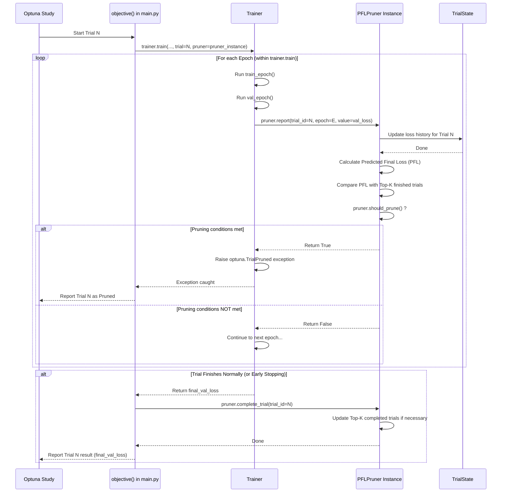

# Chapter 6: Pruning Strategy (`PFLPruner`)

Welcome back! In [Chapter 5: Hyperparameter Optimization (Optuna Integration)](05_hyperparameter_optimization__optuna_integration__.md), we discovered how Optuna acts like an automated recipe tester, running many experiments ("trials") to find the best hyperparameter settings for our model. This is incredibly useful, but running dozens or hundreds of full training sessions can take a lot of time and computational power.

What if some of those trials are clearly performing poorly right from the start? Do we really need to let them run all the way to the end?

## The Problem: Wasting Time on Bad Experiments

Imagine our automated recipe tester (Optuna) is trying 20 different cake recipes. Some recipes just don't work well. Maybe one cake starts burning after only 10 minutes in the oven, while another isn't rising at all. It seems obvious these aren't going to be the winning recipes.

Wouldn't it be great if the tester could recognize these early signs of failure and just *stop* those bad baking attempts early? This would save ingredients (computational resources like CPU/GPU time) and allow the tester to focus on trying more promising recipes.

In hyperparameter optimization, a "trial" (one specific set of hyperparameters) might result in a model whose validation loss starts high and doesn't decrease much, or even increases. Letting this trial run for the full 50 or 100 epochs is wasteful if we can already tell it's unlikely to beat the best trials seen so far.

## The Solution: An Efficiency Expert for Trials (`PFLPruner`)

This is where **pruning** comes in. Pruning is like having an **efficiency expert** watching over the shoulder of our recipe tester (Optuna). This expert monitors how each trial is doing during its early stages (early epochs).

`pytorch_template` includes a specific type of pruner called `PFLPruner`. PFL stands for **Predicted Final Loss**. Here's how it works:

1.  **Monitor Early Performance:** The `PFLPruner` watches the validation loss (or another metric) of a trial during the initial epochs.
2.  **Predict the Future:** Based on this early trend, it tries to *predict* what the *final* validation loss might be if the trial were allowed to run to completion. It's like the expert saying, "Based on how this cake is baking now, I predict it will end up burnt."
3.  **Compare with the Best:** It compares this predicted final loss with the performance of the best trials completed so far.
4.  **Prune if Unpromising:** If the predicted final loss for the current trial looks significantly worse than the best ones already finished, the pruner tells Optuna: "Stop this trial early! It's not worth continuing." This is called **pruning** the trial.

By stopping unpromising trials early, pruning can significantly speed up the overall hyperparameter optimization process, allowing you to find good hyperparameters faster or explore more possibilities in the same amount of time.

## How to Use the `PFLPruner`

Using the pruner is straightforward. You configure it within the Optuna optimization settings file (`configs/optimize_template.yaml`).

1.  **Enable in Configuration (`configs/optimize_template.yaml`):**
    Locate the `pruner:` section in your optimization configuration file.

    ```yaml
    # configs/optimize_template.yaml
    study_name: Optimize_MLP_Example
    trials: 20
    metric: val_loss
    direction: minimize
    # ... sampler settings ...

    # --- Pruner Configuration ---
    pruner:
      # Specify the PFLPruner class from the pruner.py file
      name: pruner.PFLPruner
      # Provide settings for the pruner
      kwargs:
        n_startup_trials: 5  # Don't prune during the first 5 trials
        n_warmup_epochs: 10  # Don't prune within the first 10 epochs of ANY trial
        top_k: 10            # Compare against the top 10 completed trials
        target_epoch: 50     # The final epoch used for prediction (should match training epochs)

    # ... search_space settings ...
    ```
    *   `name: pruner.PFLPruner`: Tells Optuna to use the `PFLPruner` class defined in `pruner.py`.
    *   `kwargs`: These are arguments passed to the `PFLPruner` when it's created.
        *   `n_startup_trials`: How many trials should complete *without* any pruning, just to get a baseline.
        *   `n_warmup_epochs`: For any given trial, how many epochs must pass *before* pruning is even considered for that trial. This gives the trial a chance to stabilize.
        *   `top_k`: The pruner keeps track of the best `k` completed trials. It compares the current trial's predicted performance against these.
        *   `target_epoch`: The total number of epochs the training is supposed to run. The pruner uses this to predict the loss *at* this final epoch. **Make sure this matches the `epochs` setting in your `RunConfig`!**

2.  **Run Optimization:**
    Start the optimization process exactly as you did in [Chapter 5: Hyperparameter Optimization (Optuna Integration)](05_hyperparameter_optimization__optuna_integration__.md):

    ```bash
    python main.py --run_config configs/run_template.yaml --optimize_config configs/optimize_template.yaml
    ```

3.  **Observe the Output:**
    As the trials run, you might now see messages indicating that a trial was pruned:

    ```
    Trial 3 finished with value: 0.0150 and parameters: {...}. Best is trial 2 with value: 0.0080.
    Trial 4 finished with value: 0.0110 and parameters: {...}. Best is trial 2 with value: 0.0080.
    Trial 5 finished with value: 0.0090 and parameters: {...}. Best is trial 2 with value: 0.0080.
    # --- Startup trials finished, pruning might begin ---
    Trial 6 pruned. # Pruner decided to stop this trial early!
    Trial 7 finished with value: 0.0075 and parameters: {...}. Best is trial 7 with value: 0.0075.
    Trial 8 pruned.
    ...
    ```
    Seeing "pruned" trials means the `PFLPruner` is working, saving you time by cutting short the experiments that weren't looking promising!

## Internal Implementation: How the Pruner Works with Optuna and the Trainer

How does the pruner actually intervene in the training process? It integrates with Optuna and the `Trainer` ([Chapter 3: Training Loop (`Trainer`)](03_training_loop___trainer___.md)).

### High-Level Flow

During an Optuna optimization run (`study.optimize`), for each trial:



1.  **Setup:** When `main.py` sets up the Optuna study ([Chapter 5]), it also creates the `PFLPruner` instance based on the `optimize_config.yaml`. This pruner instance is passed down through the `objective` function to the `util.run` function, and finally to the `Trainer` when it's initialized for a specific trial.
2.  **Report:** Inside the `Trainer.train` loop, after each epoch's validation loss is calculated, it calls `pruner.report(trial_id, seed, epoch, val_loss)`. The pruner records this loss value for the current trial and epoch.
3.  **Check:** The `Trainer` then immediately calls `pruner.should_prune()`.
4.  **Decision:** The `PFLPruner` checks:
    *   Are we past the `n_startup_trials` and `n_warmup_epochs`?
    *   If yes, it calculates the Predicted Final Loss based on the history recorded so far for this trial.
    *   It compares this prediction to the performance of the `top_k` best *completed* trials.
    *   If the prediction is worse than the threshold (e.g., worse than the worst of the `top_k`), `should_prune()` returns `True`.
5.  **Action:**
    *   If `should_prune()` returns `True`, the `Trainer` raises a special `optuna.TrialPruned` exception. This stops the `Trainer.train` loop immediately. The exception is caught higher up, and Optuna marks the trial as "Pruned".
    *   If `should_prune()` returns `False`, training continues to the next epoch.
6.  **Completion:** If a trial finishes *without* being pruned (either reaches the end or triggers early stopping), the `run` function calls `pruner.complete_trial()`. The pruner then calculates the final metrics for this completed trial and potentially updates its list of `top_k` performers.

### Code Walkthrough

1.  **Creating the Pruner (`config.py` - `OptimizeConfig`):**
    Similar to creating the sampler, `OptimizeConfig` dynamically creates the specified pruner.

    ```python
    # config.py (Inside OptimizeConfig class)
    import importlib
    # ... other imports ...

    class OptimizeConfig:
        # ... other fields and methods ...

        def create_pruner(self):
            # Check if pruner config exists and has a 'name'
            if not hasattr(self, "pruner") or "name" not in self.pruner:
                return None # No pruner configured

            # Get the pruner class name (e.g., "pruner.PFLPruner")
            module_name, class_name = self.pruner["name"].rsplit(".", 1)
            # Load the module (pruner.py)
            module = importlib.import_module(module_name)
            # Get the class (PFLPruner)
            pruner_class = getattr(module, class_name)
            # Get the arguments (kwargs) from the YAML
            pruner_kwargs = self.pruner.get("kwargs", {})

            # Create an instance of the pruner class with its arguments
            return pruner_class(**pruner_kwargs)
    ```
    This method reads the `pruner:` section of the YAML, loads the specified class (e.g., `PFLPruner` from `pruner.py`), and creates an instance using the provided `kwargs`.

2.  **Passing the Pruner (`main.py` and `util.py`):**
    The created pruner instance is passed down to where it's needed.

    ```python
    # main.py (Inside objective function)
    optimize_config = OptimizeConfig.from_yaml(args.optimize_config)
    pruner = optimize_config.create_pruner() # Pruner created here
    # ...
    study.optimize(
        lambda trial: objective(
            trial, base_config, optimize_config, dl_train, dl_val, pruner # Pass pruner
        ),
        n_trials=optimize_config.trials,
    )

    # main.py (objective function definition)
    def objective(trial, ..., pruner): # Receive pruner
        # ... suggest params, create run_config_trial ...
        return run( # Pass pruner to run function
            run_config_trial, dl_train, dl_val, group_name, trial=trial, pruner=pruner
        )

    # util.py (run function definition)
    def run(run_config: RunConfig, ..., trial=None, pruner=None): # Receive pruner
        # ... set seed, create model/optimizer ...
        trainer = Trainer( # Pass pruner to Trainer
            model, optimizer, ..., trial=trial, seed=seed, pruner=pruner
        )
        val_loss = trainer.train(...)
        # ... finish up ...
        return val_loss
    ```
    This shows the chain: `OptimizeConfig` creates the pruner, `main.py` passes it to the `objective` function, `objective` passes it to `util.run`, and `run` passes it to the `Trainer`.

3.  **Using the Pruner (`util.py` - `Trainer.train`):**
    The `Trainer` calls the pruner's methods at the end of each epoch.

    ```python
    # util.py (Simplified Trainer.train method)
    import optuna # Needed for TrialPruned exception

    class Trainer:
        # ... __init__ stores self.pruner, self.trial, self.seed ...

        def train(self, dl_train, dl_val, epochs):
            # ... initialization ...
            for epoch in range(epochs):
                # ... train_epoch, val_epoch ...
                val_loss = self.val_epoch(dl_val)
                val_losses.append(val_loss)

                # ... NaN checks, EarlyStopping checks ...

                # --- Pruning Check ---
                # Check if a pruner, trial, and seed are available
                if (
                    self.pruner is not None
                    and self.trial is not None
                    and self.seed is not None
                ):
                    # 1. Report the intermediate value (validation loss)
                    self.pruner.report(
                        trial_id=self.trial.number,
                        seed=self.seed,
                        epoch=epoch,
                        value=val_loss, # Report the metric Optuna cares about
                    )
                    # 2. Check if the pruner says to stop
                    if self.pruner.should_prune():
                        print(f"Trial {self.trial.number} pruned at epoch {epoch}.")
                        # Raise the special exception Optuna understands
                        raise optuna.TrialPruned()

                # ... scheduler step, logging, printing ...
            return val_loss # Return final loss if not pruned
    ```
    This shows the crucial integration point: calling `self.pruner.report()` and then `self.pruner.should_prune()`. If `should_prune()` is true, it raises the exception to stop training for this trial.

4.  **PFL Pruner Logic (`pruner.py` - Simplified `PFLPruner`):**
    Let's look at the core logic inside `PFLPruner`.

    ```python
    # pruner.py (Simplified PFLPruner)
    from util import predict_final_loss # Helper to predict loss
    import numpy as np

    class PFLPruner(BasePruner): # Inherits from a base class
        def __init__(self, n_startup_trials=5, n_warmup_epochs=10, top_k=10, target_epoch=50):
            super().__init__()
            # Store configuration
            self.n_startup_trials = n_startup_trials
            self.n_warmup_epochs = n_warmup_epochs
            self.top_k = top_k
            self.target_epoch = target_epoch
            # Stores (final_loss, predicted_final_loss) for top K completed trials
            self.top_pairs: List[Tuple[float, float]] = []
            self.completed_trials = 0

        def report(self, trial_id: int, seed: int, epoch: int, value: float):
            # Store the reported value (loss) for the given trial, seed, epoch
            # (Uses the Trial dataclass defined in pruner.py)
            # ... implementation details omitted ...
            super().report(trial_id, seed, epoch, value)

        def complete_trial(self, trial_id: int):
            # Called when a trial finishes *without* pruning
            self.completed_trials += 1
            # Calculate the actual final loss and predicted final loss for the completed trial
            # Update self.top_pairs if this trial is good enough
            # ... implementation details omitted ...
            super().complete_trial(trial_id) # Clean up trial state

        def _predict_final_loss(self, losses: List[float]) -> float:
             # Uses the loss history for one seed to predict the final loss
             # Returns a PFL score (higher is better in this implementation)
            if len(losses) < 10: # Not enough data yet
                 return -np.log10(losses[-1]) if losses else -float('inf')
            try:
                 # Call the helper function from util.py
                 return predict_final_loss(losses, self.target_epoch)
            except:
                 return -float('inf') # Prediction failed

        def _compute_trial_metrics(self, trial: Trial) -> Tuple[float, float]:
             # Calculate the average current loss and average PFL across all seeds for this trial
             # ... implementation details omitted ...
             avg_loss = ...
             avg_pfl = ...
             return avg_loss, avg_pfl

        def _should_prune_trial(self, trial: Trial) -> bool:
            # The core pruning decision logic

            # 1. Check if we are in the startup/warmup phase
            if (self.completed_trials < self.n_startup_trials or
                trial.current_epoch <= self.n_warmup_epochs):
                return False # Don't prune yet

            # 2. Get the current trial's predicted performance (PFL)
            _, current_pfl = self._compute_trial_metrics(trial)

            # 3. Check if prediction is valid
            if not np.isfinite(current_pfl):
                print(f"Pruning trial {trial.trial_id} due to non-finite prediction.")
                return True # Prune if prediction failed

            # 4. Compare with the best completed trials
            if self.top_pairs: # Do we have any completed trials for comparison?
                # Find the worst PFL among the top K completed trials
                worst_saved_pfl = min(pair[1] for pair in self.top_pairs)
                # Prune if the current trial's prediction is worse than that
                if current_pfl < worst_saved_pfl:
                    print(f"Pruning trial {trial.trial_id}: PFL {current_pfl:.2f} < WorstTopK {worst_saved_pfl:.2f}")
                    return True

            # 5. If none of the above conditions met, don't prune
            return False

        # ... other helper methods like _check_and_insert for managing top_pairs ...
    ```
    This simplified view shows the main steps: check warmup conditions, calculate the current trial's predicted final loss (PFL), compare it against the PFLs of the best `top_k` completed trials, and return `True` (prune) if it looks worse.

## Conclusion

You've learned about **pruning**, a valuable technique for making hyperparameter optimization ([Chapter 5]) more efficient.

Key takeaways:

*   Pruning stops unpromising trials early during hyperparameter optimization, saving time and resources.
*   The **`PFLPruner`** (Predicted Final Loss Pruner) monitors a trial's early performance, predicts its final outcome, and prunes it if it looks worse than the best trials seen so far.
*   You enable and configure the pruner in the `pruner:` section of your `optimize_template.yaml` file ([Chapter 1]).
*   The `PFLPruner` integrates with Optuna and the `Trainer` ([Chapter 3]) via the `report` and `should_prune` methods.

By using pruning, you can get results from your hyperparameter searches faster, allowing for more effective exploration of different model configurations.

Now that we know how to run single experiments, optimize hyperparameters efficiently, and understand the core components like the model and trainer, how do we analyze the results of our experiments and the models we've trained?

**Next Up:** [Chapter 7: Analysis Utilities (`analyze.py` / `util.py`)](07_analysis_utilities___analyze_py_____util_py___.md)

---

Generated by [AI Codebase Knowledge Builder](https://github.com/The-Pocket/Tutorial-Codebase-Knowledge)
