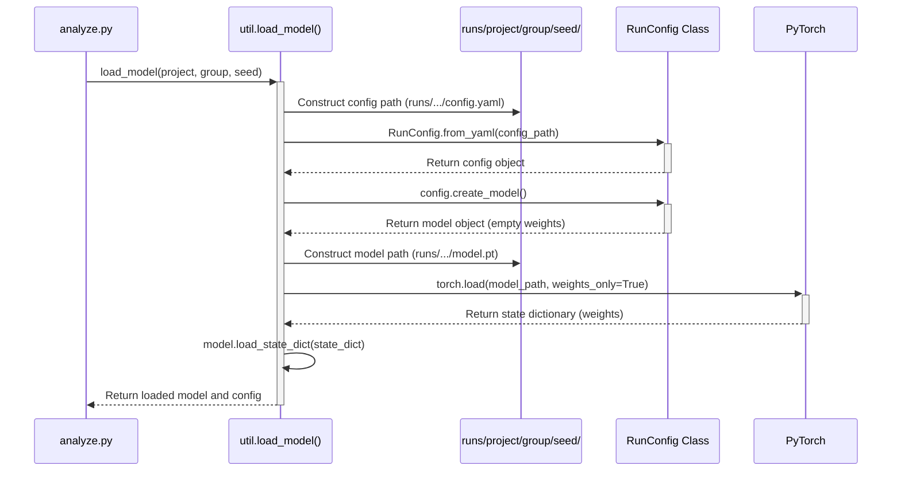

# Chapter 7: Analysis Utilities (`analyze.py` / `util.py`)

Welcome to the final chapter! In [Chapter 6: Pruning Strategy (`PFLPruner`)](06_pruning_strategy___pflpruner___.md), we saw how to make hyperparameter searches more efficient by stopping unpromising experiments early. Whether you've run a single experiment or a large optimization study (perhaps with pruning!), the next crucial step is to examine the results. How did your model actually perform? Can you load the trained model and test it?

## The Problem: Examining Your Experiment Results

Imagine you're a scientist who just finished a series of lab experiments. You have notebooks full of observations, samples in petri dishes, and maybe even microscope slides. Now you need the tools to analyze these results: a microscope to look closely at the slides, methods to measure the samples, and ways to organize your notes.

Similarly, after running machine learning experiments using `pytorch_template`, you have generated results:
*   Saved **model weights** (`model.pt` files) representing what the model learned.
*   **Configuration files** (`config.yaml`) recording the exact settings used for each run.
*   **Logs** (potentially in Weights & Biases, and locally in `runs/`).
*   An **Optuna database** (`YourProject.db`) if you ran an optimization study, recording all trials and their outcomes.

How do you easily access and make sense of all this? How can you load a specific model you trained and see how well it performs on data it hasn't seen before?

## The Solution: Your Post-Experiment Toolkit (`analyze.py` and `util.py`)

`pytorch_template` provides a dedicated script, `analyze.py`, and several helper functions within `util.py` that act as your **post-experiment analysis toolkit**. Think of `analyze.py` as the main interface to your "lab," and the functions in `util.py` as the specific tools (like microscopes or measurement devices).

This toolkit helps you:
*   **Find and select** specific experiments (projects, run groups, seeds) you want to inspect.
*   **Load** the saved model weights and the corresponding configuration for a chosen experiment run.
*   **Load** the results of an entire Optuna optimization study.
*   **Identify and load** the *best* model discovered during an optimization study.
*   **Evaluate** a loaded model on a dataset (e.g., the validation set) to see its performance.

## Use Case 1: Loading and Testing a Specific Run

Let's say you ran an experiment using the configuration in `configs/run_template.yaml` (which defined `project: MyCoolProject`), and it saved results under a group name like `MLP_n_64_l_4...` with a specific random seed, say `42`. You now want to load the model trained with seed `42` and check its final validation loss.

1.  **Run the Analysis Script:**
    Open your terminal in the project directory and run:

    ```bash
    python analyze.py
    ```

2.  **Interactive Selection:**
    The script will guide you using interactive prompts (powered by the `beaupy` library via helper functions in `util.py`):

    ```
    [bold green]Analyzing the model...[/bold green]
    Select a project to analyze:
     MyCoolProject  # Use arrow keys and Enter to select
    > AnotherProject
    Select a group to analyze:
     MLP_n_32_l_3...
    > MLP_n_64_l_4... # Select the group you're interested in
     CNN_run_1...
    Select a seed to analyze:
    > 42            # Select the seed you want to load
     123
    Select a device:
     cpu
    > cuda:0        # Choose where to load the model (CPU or GPU)
    ```
    You interactively choose the project, the specific run group (often named based on hyperparameters), and the seed within that group.

3.  **Loading and Testing:**
    Once you've made your selections, `analyze.py` uses helper functions from `util.py` to:
    *   Load the configuration (`config.yaml`) saved for that run group.
    *   Load the model weights (`model.pt`) saved for the specific seed you chose.
    *   Load the validation dataset.
    *   Run the loaded model on the validation data and calculate the loss.

4.  **See the Result:**
    The script will print the final validation loss:

    ```
    Validation Loss: 0.009512...
    ```
    This tells you the performance of that specific trained model.

### How it Works (Simplified `analyze.py`):

```python
# analyze.py (Simplified)
import torch
import torch.nn.functional as F
from rich.console import Console

# Import helper functions from util.py
from util import (
    select_project, select_group, select_seed, select_device,
    load_model, load_data
)

# --- Function to evaluate the model ---
def test_model(model, dl_val, device):
    model.eval() # Set model to evaluation mode
    total_loss = 0
    # No need to track gradients for testing
    with torch.no_grad():
        # Loop through validation data batches
        for x, y in dl_val:
            x, y = x.to(device), y.to(device) # Move data to device
            y_pred = model(x) # Get model prediction
            loss = F.mse_loss(y_pred, y) # Calculate loss (MSE in this case)
            total_loss += loss.item()
    # Return average loss
    return total_loss / len(dl_val)

# --- Main analysis logic ---
def main():
    console = Console()
    console.print("[bold green]Analyzing the model...[/bold green]")

    # 1. Interactive Selection using helpers from util.py
    console.print("Select a project to analyze:")
    project = select_project()
    console.print("Select a group to analyze:")
    group_name = select_group(project)
    console.print("Select a seed to analyze:")
    seed = select_seed(project, group_name)
    console.print("Select a device:")
    device = select_device()

    # 2. Load the selected model and its config using util.load_model
    #    'weights_only=True' is a safe default for faster loading
    model, config = load_model(project, group_name, seed, weights_only=True)
    model = model.to(device) # Move model to selected device
    print(f"Loaded model from {project}/{group_name}/{seed}")
    print(f"Run Configuration: {config}")

    # 3. Load the validation data (using util.load_data)
    _, ds_val = load_data() # pyright: ignore
    # Create a DataLoader for batching
    dl_val = torch.utils.data.DataLoader(ds_val, batch_size=config.batch_size)

    # 4. Test the model using the test_model function
    val_loss = test_model(model, dl_val, device)

    # 5. Print the result
    print(f"\nValidation Loss: {val_loss}")

if __name__ == "__main__":
    main()
```
*   The `select_project`, `select_group`, `select_seed`, `select_device` functions (defined in `util.py`) handle the interactive prompts.
*   `load_model` (from `util.py`) does the work of finding the right files (`config.yaml`, `model.pt`) based on your selections and loading them.
*   `load_data` (from `util.py`) gets the dataset (we only need the validation part here).
*   `test_model` performs a simple evaluation loop, similar to the `Trainer.val_epoch` method from [Chapter 3: Training Loop (`Trainer`)](03_training_loop___trainer___.md).

## Use Case 2: Loading the Best Model from an Optimization Study

Maybe you ran a hyperparameter search using Optuna ([Chapter 5]) named `Optimize_MLP_Example` within your `MyCoolProject`. Optuna found the best set of parameters. How do you load the actual model corresponding to that best trial?

`util.py` provides functions for this too!

1.  **Modify `analyze.py` (Slightly):**
    You would typically comment out the single-run loading part and uncomment/add code to load the best model from a study.

    ```python
    # analyze.py (Modified main function for loading best model)
    from util import load_best_model, load_study # Add these imports

    def main():
        console = Console()
        console.print("[bold green]Analyzing BEST model from study...[/bold green]")

        # --- Option 1: Load Specific Run (Commented out) ---
        # console.print("Select a project to analyze:")
        # project = select_project()
        # console.print("Select a group to analyze:")
        # group_name = select_group(project)
        # console.print("Select a seed to analyze:")
        # seed = select_seed(project, group_name)
        # console.print("Select a device:")
        # device = select_device()
        # model, config = load_model(project, group_name, seed)

        # --- Option 2: Load Best Model from Study ---
        console.print("Select the project containing the study:")
        project = select_project() # e.g., MyCoolProject
        study_name = "Optimize_MLP_Example" # Specify the study name
        console.print(f"Loading best model from study: {study_name}")
        # Use load_best_model from util.py
        model, config = load_best_model(project, study_name)
        console.print("Select a device:")
        device = select_device()
        model = model.to(device)
        print(f"Loaded BEST model from study {study_name}")
        print(f"Best Run Configuration: {config}")

        # --- Continue with testing as before ---
        _, ds_val = load_data()
        dl_val = torch.utils.data.DataLoader(ds_val, batch_size=config.batch_size)
        val_loss = test_model(model, dl_val, device)
        print(f"\nValidation Loss for Best Model: {val_loss}")

    if __name__ == "__main__":
        main()
    ```
    Here, we replaced the interactive selection of `group` and `seed` with a call to `load_best_model`, providing the project and study name.

2.  **Run `analyze.py`:**
    Execute `python analyze.py`. It will first ask for the project, then directly load the best model. It might still ask you to select a *seed* if the best trial group involved multiple seeds. Finally, it tests and reports the validation loss for that best model.

## Internal Implementation: Peeking Inside the Toolkit

Let's briefly look at how some key helper functions in `util.py` work.

### Helper: `select_*` Functions

These functions (`select_project`, `select_group`, `select_seed`) are quite simple. They:
1.  List the directories within the relevant path (e.g., `runs/` for projects, `runs/MyCoolProject/` for groups).
2.  Use the `beaupy.select()` function to display these directories as an interactive list in the terminal.
3.  Return the directory name chosen by the user.

```python
# util.py (Simplified select_group example)
import os
import beaupy # Library for interactive prompts

def select_group(project):
    runs_path = f"runs/{project}" # Path to the project's runs
    # List only directories inside the project folder
    groups = [
        d for d in os.listdir(runs_path) if os.path.isdir(os.path.join(runs_path, d))
    ]
    if not groups:
        raise ValueError(f"No run groups found in {runs_path}")

    # Show the list and let the user choose
    selected_group = beaupy.select(groups, cursor="->", cursor_style="cyan")
    return selected_group
```

### Helper: `load_model`

This function is responsible for finding the configuration and model weights for a specific run and loading them.



1.  **Paths:** It constructs the full paths to the `config.yaml` file (in the group directory) and the `model.pt` file (in the seed directory).
2.  **Load Config:** It uses `RunConfig.from_yaml` ([Chapter 1: Configuration Management (`RunConfig` / `OptimizeConfig`)](01_configuration_management___runconfig_____optimizeconfig___.md)) to load the experiment's settings.
3.  **Create Model Shell:** It uses the loaded `config` object's `create_model` method ([Chapter 4: Model Definition (`model.py`)](04_model_definition___model_py___.md)) to build the model structure (but with random initial weights).
4.  **Load Weights:** It uses `torch.load(model_path, weights_only=True)` to load *only* the saved weights (the `state_dict`) from the `.pt` file. `weights_only=True` is generally safer and more efficient than loading arbitrary pickled Python code.
5.  **Apply Weights:** It calls `model.load_state_dict()` to copy the saved weights into the model structure created in step 3.
6.  **Return:** It returns the fully loaded model and the configuration object.

```python
# util.py (Simplified load_model)
import os
import torch
from config import RunConfig # Need RunConfig to load the config file

def load_model(project, group_name, seed, weights_only=True):
    # Construct file paths
    config_path = f"runs/{project}/{group_name}/config.yaml"
    model_path = f"runs/{project}/{group_name}/{seed}/model.pt"

    # Check if files exist
    if not os.path.exists(config_path):
        raise FileNotFoundError(f"Config file not found: {config_path}")
    if not os.path.exists(model_path):
        raise FileNotFoundError(f"Model file not found: {model_path}")

    # 1. Load the configuration from the YAML file
    config = RunConfig.from_yaml(config_path)

    # 2. Create the model structure based on the config
    model = config.create_model() # Model has random weights initially

    # 3. Load the saved weights (state dictionary)
    #    map_location='cpu' ensures it loads even if trained on GPU
    state_dict = torch.load(model_path, map_location="cpu", weights_only=weights_only)

    # 4. Apply the loaded weights to the model structure
    model.load_state_dict(state_dict)

    # 5. Return the loaded model and its config
    return model, config
```

### Helper: `load_study` and `load_best_model`

*   **`load_study`:** This function simply uses Optuna's built-in `optuna.load_study` function. It needs the `study_name` and the path to the Optuna database file (which is constructed as `sqlite:///{project}.db`).

    ```python
    # util.py (Simplified load_study)
    import optuna

    def load_study(project, study_name):
        # Construct the path to the Optuna SQLite database
        storage_path = f"sqlite:///{project}.db"
        # Use Optuna's function to load the study results
        study = optuna.load_study(study_name=study_name, storage=storage_path)
        return study
    ```

*   **`load_best_model`:** This function orchestrates finding and loading the best model.

    ```mermaid
    sequenceDiagram
        participant AnalyzePy as analyze.py
        participant LoadBest as util.load_best_model()
        participant LoadStudy as util.load_study()
        participant OptunaDB as Optuna DB (SQLite)
        participant SelectSeed as util.select_seed()
        participant LoadModel as util.load_model()

        AnalyzePy->>+LoadBest: load_best_model(project, study_name)
        LoadBest->>+LoadStudy: load_study(project, study_name)
        LoadStudy->>+OptunaDB: Query study details
        OptunaDB-->>-LoadStudy: Return study object
        LoadStudy-->>-LoadBest: Return study object
        LoadBest->>LoadBest: Get study.best_trial
        LoadBest->>LoadBest: Get group name from best_trial.user_attrs['group_name']
        LoadBest->>+SelectSeed: select_seed(project, group_name) # Ask user for seed
        SelectSeed-->>-LoadBest: Return selected_seed
        LoadBest->>+LoadModel: load_model(project, group_name, selected_seed)
        LoadModel-->>-LoadBest: Return best_model, best_config
        LoadBest-->>-AnalyzePy: Return best_model, best_config
    ```

    1.  It calls `load_study` to get the Optuna study object.
    2.  It accesses `study.best_trial` to find the best performing trial.
    3.  It retrieves the `group_name` associated with that best trial (which was saved in `user_attrs` during the optimization - see Chapter 5's objective function).
    4.  Since a group might contain runs with multiple seeds, it calls `select_seed` to let the user choose which seed's model from the best group they want to load.
    5.  Finally, it calls `load_model` with the project, the best trial's group name, and the user-selected seed.

    ```python
    # util.py (Simplified load_best_model)

    def load_best_model(project, study_name, weights_only=True):
        # 1. Load the Optuna study results
        study = load_study(project, study_name)
        # 2. Get the trial object corresponding to the best result
        best_trial = study.best_trial

        # 3. Retrieve the group name saved during optimization
        group_name = best_trial.user_attrs["group_name"]
        print(f"Best trial corresponds to group: {group_name}")

        # 4. Ask the user to select a seed from that best group
        print(f"Select a seed from the best group '{group_name}':")
        seed = select_seed(project, group_name)

        # 5. Load the model using the standard load_model function
        best_model, best_config = load_model(
            project, group_name, seed, weights_only=weights_only
        )

        return best_model, best_config
    ```

## Conclusion

Congratulations! You've reached the end of the `pytorch_template` tutorial. In this final chapter, you learned how to use the analysis utilities provided by `analyze.py` and helper functions in `util.py`.

Key takeaways:
*   `analyze.py` is the entry point for inspecting results after experiments finish.
*   Helper functions (`select_*`, `load_model`, `load_study`, `load_best_model`) provide the tools for finding and loading specific runs or the best results from optimization.
*   You can easily load a saved model and its configuration, then evaluate it on a dataset.
*   Loading the best model from an Optuna study is also streamlined.

You now have a comprehensive understanding of how `pytorch_template` helps you manage configurations ([Chapter 1]), orchestrate runs ([Chapter 2]), perform training ([Chapter 3]), define models ([Chapter 4]), optimize hyperparameters ([Chapter 5]), prune inefficient trials ([Chapter 6]), and finally, analyze your results ([Chapter 7]).

With this foundation, you are well-equipped to use `pytorch_template` to structure, run, and understand your own machine learning experiments effectively. Happy coding!

---

Generated by [AI Codebase Knowledge Builder](https://github.com/The-Pocket/Tutorial-Codebase-Knowledge)