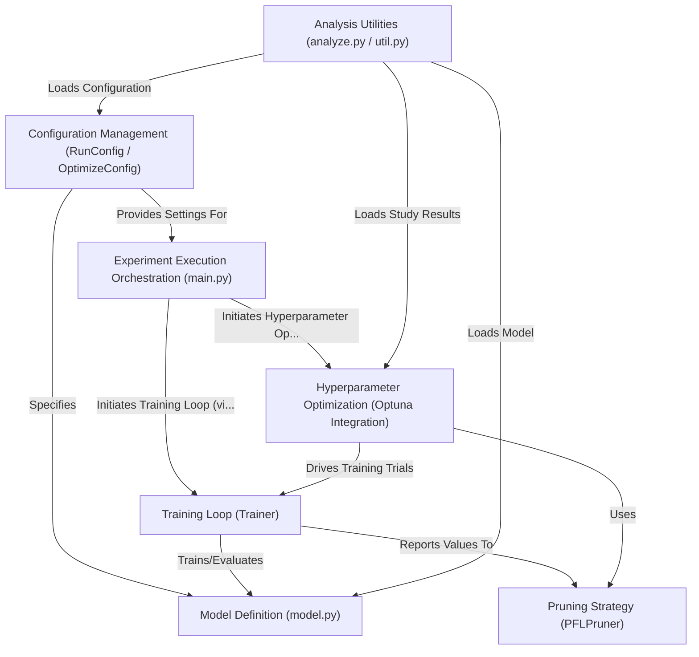

# Tutorial: pytorch_template

This project provides a **reusable template** for building and running PyTorch machine learning experiments.
It helps structure your code for *training models*, automatically finding the best *hyperparameters* using Optuna, and *analyzing* the results.
Everything is managed through simple **configuration files** (YAML), making experiments easy to define, reproduce, and modify.

**Source Repository:** [pytorch_template](https://github.com/Axect/pytorch_template)

## Chapters

1. [Configuration Management (`RunConfig` / `OptimizeConfig`)
](01_configuration_management___runconfig_____optimizeconfig___.html)
2. [Experiment Execution Orchestration (`main.py`)
](02_experiment_execution_orchestration___main_py___.html)
3. [Training Loop (`Trainer`)
](03_training_loop___trainer___.html)
4. [Model Definition (`model.py`)
](04_model_definition___model_py___.html)
5. [Hyperparameter Optimization (Optuna Integration)
](05_hyperparameter_optimization__optuna_integration__.html)
6. [Pruning Strategy (`PFLPruner`)
](06_pruning_strategy___pflpruner___.html)
7. [Analysis Utilities (`analyze.py` / `util.py`)
](07_analysis_utilities___analyze_py_____util_py___.html)

---

Generated by [AI Codebase Knowledge Builder](https://github.com/The-Pocket/Tutorial-Codebase-Knowledge)
